# Unity Editor Built-in Icons
Unity version **6000.2.7f2**

## Load icons using `EditorGUIUtility.IconContent("icon_name");`

> Icons are artificially given light/dark backgrounds depending on their luminance, to be easier to view.
> The vast majority of icons have transparent backgrounds when loaded in the editor.

All icons are clickable, you will be forwarded to description file.
| Icon | Name |
|------|------|
|   | `_Help@2x` `_Help` |
|   | `_Menu@2x` `_Menu` |
|   | `_Popup@2x` `_Popup` |
|  | `085_SpriteShape_Batching_Multi_Material` |
|  | `2d-badge-scene-template` |
|  | `3d-badge-scene-template` |
|  | `AimConstraint Icon` |
|  | `AISparkle Icon` |
|   | `AISparkle@2x` `AISparkle` |
|   | `alertDialog@2x` `alertDialog` |
|  | `align_horizontally` |
|  | `align_horizontally_center` |
|  | `align_horizontally_center_active` |
|  | `align_horizontally_left` |
|  | `align_horizontally_left_active` |
|  | `align_horizontally_right` |
|  | `align_horizontally_right_active` |
|  | `align_vertically` |
|  | `align_vertically_bottom` |
|  | `align_vertically_bottom_active` |
|  | `align_vertically_center` |
|  | `align_vertically_center_active` |
|  | `align_vertically_top` |
|  | `align_vertically_top_active` |
|   | `AlphabeticalSorting@2x` `AlphabeticalSorting` |
|  | `AnalyticsTracker Icon` |
|   | `AnchorTransformTool On@2x` `AnchorTransformTool On` |
|   | `AnchorTransformTool@2x` `AnchorTransformTool` |
|  | `Animation Icon` |
|   | `Animation.AddEvent@2x` `Animation.AddEvent` |
|   | `Animation.AddKeyframe@2x` `Animation.AddKeyframe` |
|   | `Animation.EventMarker@2x` `Animation.EventMarker` |
|   | `Animation.FilterBySelection@2x` `Animation.FilterBySelection` |
|   | `Animation.FirstKey@2x` `Animation.FirstKey` |
|   | `Animation.LastKey@2x` `Animation.LastKey` |
|   | `Animation.NextKey@2x` `Animation.NextKey` |
|   | `Animation.Play@2x` `Animation.Play` |
|   | `Animation.PrevKey@2x` `Animation.PrevKey` |
|   | `Animation.Record@2x` `Animation.Record` |
|  | `Animation.SequencerLink` |
|   | `animationanimated@2x` `animationanimated` |
|  | `AnimationClip Icon` |
|  | `AnimationClip On Icon` |
|  | `animationdopesheetkeyframe` |
|   | `animationkeyframe@2x` `animationkeyframe` |
|  | `animationnocurve` |
|   | `animationvisibilitytoggleoff@2x` `animationvisibilitytoggleoff` |
|   | `animationvisibilitytoggleon@2x` `animationvisibilitytoggleon` |
|  | `AnimationWindowEvent Icon` |
|  | `AnimationWrapModeMenu` |
|  | `Animator Icon` |
|  | `AnimatorController Icon` |
|  | `AnimatorController On Icon` |
|  | `AnimatorOverrideController Icon` |
|  | `AnimatorOverrideController On Icon` |
|  | `AnimatorState Icon` |
|  | `AnimatorStateMachine Icon` |
|  | `AnimatorStateTransition Icon` |
|  | `AnyStateNode Icon` |
|  | `AreaEffector2D Icon` |
|  | `AreaLight Gizmo` |
|  | `AreaLight Icon` |
|  | `ArticulationBody Icon` |
|  | `AspectRatioFitter Icon` |
|  | `Assembly Icon` |
|  | `AssemblyDefinitionAsset Icon` |
|  | `AssemblyDefinitionReferenceAsset Icon` |
|  | `AssemblyLock` |
|   | `Asset Store@2x` `Asset Store` |
|   | `AssetLabelIconSquare@2x` `AssetLabelIconSquare` |
|  | `AssetStore Icon` |
|   | `Audio Mixer@2x` `Audio Mixer` |
|  | `AudioChorusFilter Icon` |
|  | `AudioClip Icon` |
|  | `AudioClip On Icon` |
|  | `AudioDistortionFilter Icon` |
|  | `AudioEchoFilter Icon` |
|  | `AudioHighPassFilter Icon` |
|  | `AudioImporter Icon` |
|  | `AudioListener Icon` |
|  | `AudioLowPassFilter Icon` |
|  | `AudioMixerController Icon` |
|  | `AudioMixerController On Icon` |
|  | `AudioMixerGroup Icon` |
|  | `AudioMixerSnapshot Icon` |
|  | `AudioMixerView Icon` |
|  | `AudioRandomContainer Icon` |
|  | `AudioRandomContainer On Icon` |
|  | `AudioResource Icon` |
|  | `AudioResource On Icon` |
|  | `AudioReverbFilter Icon` |
|  | `AudioReverbZone Icon` |
|  | `AudioSource Gizmo` |
|  | `AudioSource Icon` |
|  | `AudioSpatializerMicrosoft Icon` |
|   | `AutoLightbakingOff@2x` `AutoLightbakingOff` |
|   | `AutoLightbakingOn@2x` `AutoLightbakingOn` |
|  | `Avatar Icon` |
|  | `AvatarCompass` |
|  | `AvatarController.Layer` |
|  | `AvatarController.LayerHover` |
|  | `AvatarController.LayerSelected` |
|  | `AvatarMask Icon` |
|  | `AvatarMask On Icon` |
|   | `AvatarPivot@2x` `AvatarPivot` |
|   | `AvatarSelector@2x` `AvatarSelector` |
|   | `back@2x` `back` |
|  | `beginButton` |
|  | `beginButton-On` |
|   | `BigIcons.CloudArrowUp@2x` `BigIcons.CloudArrowUp` |
|   | `BigIcons.CloudCheckmark@2x` `BigIcons.CloudCheckmark` |
|   | `BigIcons.ExclamationMark@2x` `BigIcons.ExclamationMark` |
|   | `BigIcons.Gear@2x` `BigIcons.Gear` |
|  | `BillboardAsset Icon` |
|  | `BillboardRenderer Icon` |
|   | `BlendDistance On@2x` `BlendDistance On` |
|   | `BlendDistance@2x` `BlendDistance` |
|   | `blendKey@2x` `blendKey` |
|   | `blendKeyOverlay@2x` `blendKeyOverlay` |
|   | `blendKeySelected@2x` `blendKeySelected` |
|  | `blendSampler` |
|  | `BlendTree Icon` |
|  | `blueGroove` |
|  | `BodyPartPicker` |
|  | `BodySilhouette` |
|  | `boo Script Icon` |
|  | `BoxCollider Icon` |
|  | `BoxCollider2D Icon` |
|  | `BuildProfile Icon` |
|   | `BuildSettings.Android On@2x` `BuildSettings.Android On` |
|   | `BuildSettings.Android.Small@2x` `BuildSettings.Android.Small` |
|   | `BuildSettings.Android@2x` `BuildSettings.Android` |
|  | `BuildSettings.Broadcom` |
|   | `BuildSettings.DedicatedServer On@2x` `BuildSettings.DedicatedServer On` |
|   | `BuildSettings.DedicatedServer.Small@2x` `BuildSettings.DedicatedServer.Small` |
|   | `BuildSettings.DedicatedServer@2x` `BuildSettings.DedicatedServer` |
|  | `BuildSettings.Editor` |
|   | `BuildSettings.Editor.Small@2x` `BuildSettings.Editor.Small` |
|  | `BuildSettings.EmbeddedLinux On@2x` |
|   | `BuildSettings.EmbeddedLinux.Small@2x` `BuildSettings.EmbeddedLinux.Small` |
|   | `BuildSettings.EmbeddedLinux@2x` `BuildSettings.EmbeddedLinux` |
|   | `BuildSettings.Facebook On@2x` `BuildSettings.Facebook On` |
|   | `BuildSettings.Facebook.Small@2x` `BuildSettings.Facebook.Small` |
|   | `BuildSettings.Facebook@2x` `BuildSettings.Facebook` |
|  | `BuildSettings.FlashPlayer` |
|  | `BuildSettings.FlashPlayer.Small` |
|   | `BuildSettings.GameCoreScarlett On@2x` `BuildSettings.GameCoreScarlett On` |
|   | `BuildSettings.GameCoreScarlett.Small@2x` `BuildSettings.GameCoreScarlett.Small` |
|   | `BuildSettings.GameCoreScarlett@2x` `BuildSettings.GameCoreScarlett` |
|   | `BuildSettings.GameCoreXboxOne On@2x` `BuildSettings.GameCoreXboxOne On` |
|   | `BuildSettings.GameCoreXboxOne.Small@2x` `BuildSettings.GameCoreXboxOne.Small` |
|   | `BuildSettings.GameCoreXboxOne@2x` `BuildSettings.GameCoreXboxOne` |
|   | `BuildSettings.iPhone On@2x` `BuildSettings.iPhone On` |
|   | `BuildSettings.iPhone.Small@2x` `BuildSettings.iPhone.Small` |
|   | `BuildSettings.iPhone@2x` `BuildSettings.iPhone` |
|   | `BuildSettings.Linux.Small@2x` `BuildSettings.Linux.Small` |
|   | `BuildSettings.Linux@2x` `BuildSettings.Linux` |
|   | `BuildSettings.LinuxHeadlessSimulation On@2x` `BuildSettings.LinuxHeadlessSimulation On` |
|   | `BuildSettings.LinuxHeadlessSimulation.Small@2x` `BuildSettings.LinuxHeadlessSimulation.Small` |
|   | `BuildSettings.LinuxHeadlessSimulation@2x` `BuildSettings.LinuxHeadlessSimulation` |
|   | `BuildSettings.Lumin On@2x` `BuildSettings.Lumin On` |
|   | `BuildSettings.Lumin.small@2x` `BuildSettings.Lumin.small` |
|   | `BuildSettings.Lumin@2x` `BuildSettings.Lumin` |
|   | `BuildSettings.Meta On@2x` `BuildSettings.Meta On` |
|   | `BuildSettings.Meta.Small@2x` `BuildSettings.Meta.Small` |
|   | `BuildSettings.Meta@2x` `BuildSettings.Meta` |
|   | `BuildSettings.Metro On@2x` `BuildSettings.Metro On` |
|   | `BuildSettings.Metro.Small@2x` `BuildSettings.Metro.Small` |
|   | `BuildSettings.Metro@2x` `BuildSettings.Metro` |
|   | `BuildSettings.N3DS On@2x` `BuildSettings.N3DS On` |
|   | `BuildSettings.N3DS.Small@2x` `BuildSettings.N3DS.Small` |
|   | `BuildSettings.N3DS@2x` `BuildSettings.N3DS` |
|   | `BuildSettings.OSX.Small@2x` `BuildSettings.OSX.Small` |
|   | `BuildSettings.OSX@2x` `BuildSettings.OSX` |
|   | `BuildSettings.PS4 On@2x` `BuildSettings.PS4 On` |
|   | `BuildSettings.PS4.Small@2x` `BuildSettings.PS4.Small` |
|   | `BuildSettings.PS4@2x` `BuildSettings.PS4` |
|   | `BuildSettings.PS5 On@2x` `BuildSettings.PS5 On` |
|   | `BuildSettings.PS5.Small@2x` `BuildSettings.PS5.Small` |
|   | `BuildSettings.PS5@2x` `BuildSettings.PS5` |
|  | `BuildSettings.PSM` |
|  | `BuildSettings.PSM.Small` |
|  | `BuildSettings.PSP2` |
|  | `BuildSettings.PSP2.Small` |
|   | `BuildSettings.QNX On@2x` `BuildSettings.QNX On` |
|   | `BuildSettings.QNX.Small@2x` `BuildSettings.QNX.Small` |
|   | `BuildSettings.QNX@2x` `BuildSettings.QNX` |
|  | `BuildSettings.SceneList` |
|  | `BuildSettings.SelectedIcon` |
|   | `BuildSettings.Stadia On@2x` `BuildSettings.Stadia On` |
|   | `BuildSettings.Stadia.Small@2x` `BuildSettings.Stadia.small` |
|   | `BuildSettings.Stadia@2x` `BuildSettings.Stadia` |
|   | `BuildSettings.Standalone On@2x` `BuildSettings.Standalone On` |
|   | `BuildSettings.Standalone.Small@2x` `BuildSettings.Standalone.Small` |
|   | `BuildSettings.Standalone@2x` `BuildSettings.Standalone` |
|  | `BuildSettings.StandaloneBroadcom.Small` |
|  | `BuildSettings.StandaloneGLES20Emu.Small` |
|  | `BuildSettings.StandaloneGLESEmu` |
|  | `BuildSettings.StandaloneGLESEmu.Small` |
|   | `BuildSettings.Switch On@2x` `BuildSettings.Switch On` |
|   | `BuildSettings.Switch.Small@2x` `BuildSettings.Switch.Small` |
|   | `BuildSettings.Switch@2x` `BuildSettings.Switch` |
|   | `BuildSettings.tvOS On@2x` `BuildSettings.tvOS On` |
|   | `BuildSettings.tvOS.Small@2x` `BuildSettings.tvOS.Small` |
|   | `BuildSettings.tvOS@2x` `BuildSettings.tvOS` |
|   | `BuildSettings.visionOS On.Small@2x` `BuildSettings.visionOS On.Small` |
|   | `BuildSettings.visionOS On@2x` `BuildSettings.visionOS On` |
|   | `BuildSettings.visionOS.small@2x` `BuildSettings.visionOS.small` |
|   | `BuildSettings.visionOS@2x` `BuildSettings.visionOS` |
|  | `BuildSettings.Web` |
|  | `BuildSettings.Web.Small` |
|   | `BuildSettings.WebGL On@2x` `BuildSettings.WebGL On` |
|   | `BuildSettings.WebGL.Small@2x` `BuildSettings.WebGL.Small` |
|   | `BuildSettings.WebGL@2x` `BuildSettings.WebGL` |
|   | `BuildSettings.Windows.Small@2x` `BuildSettings.Windows.Small` |
|   | `BuildSettings.Windows@2x` `BuildSettings.Windows` |
|  | `BuildSettings.WP8` |
|  | `BuildSettings.WP8.Small` |
|  | `BuildSettings.Xbox360` |
|  | `BuildSettings.Xbox360.Small` |
|   | `BuildSettings.XboxOne On@2x` `BuildSettings.XboxOne On` |
|   | `BuildSettings.XboxOne.Small@2x` `BuildSettings.XboxOne.Small` |
|   | `BuildSettings.XboxOne@2x` `BuildSettings.XboxOne` |
|   | `BuiltIn@2x` `BuiltIn` |
|   | `BuiltIn@2x` `BuiltIn` |
|   | `BuiltIn-Selected-Focused@2x` `BuiltIn-Selected-Focused` |
|  | `BuoyancyEffector2D Icon` |
|  | `Button Icon` |
|   | `CacheServerConnected@2x` `CacheServerConnected` |
|   | `CacheServerDisabled@2x` `CacheServerDisabled` |
|   | `CacheServerDisconnected@2x` `CacheServerDisconnected` |
|  | `Camera Gizmo` |
|  | `Camera Icon` |
|   | `CameraPreview@2x` `CameraPreview` |
|   | `Cancel@2x` `Cancel` |
|   | `Cancel@2x` `Cancel` |
|  | `Canvas Icon` |
|  | `CanvasGroup Icon` |
|  | `CanvasRenderer Icon` |
|  | `CanvasScaler Icon` |
|  | `CapsuleCollider Icon` |
|  | `CapsuleCollider2D Icon` |
|   | `CapturePosition On@2x` `CapturePosition On` |
|   | `CapturePosition@2x` `CapturePosition` |
|  | `CharacterController Icon` |
|  | `CharacterJoint Icon` |
|  | `CheckerFloor` |
|  | `ChorusFilter Icon` |
|  | `CircleCollider2D Icon` |
|  | `Clipboard` |
|  | `Cloth Icon` |
|  | `ClothInspector.PaintTool` |
|  | `ClothInspector.PaintValue` |
|  | `ClothInspector.SelectTool` |
|  | `ClothInspector.SettingsTool` |
|  | `ClothInspector.ViewValue` |
|   | `CloudConnect@2x` `CloudConnect` |
|  | `Collab.Build` |
|  | `Collab.BuildFailed` |
|  | `Collab.BuildSucceeded` |
|  | `Collab.FileAdded` |
|  | `Collab.FileConflict` |
|  | `Collab.FileDeleted` |
| [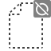](meta/Collab.FileIgnored.md) | `Collab.FileIgnored` |
|  | `Collab.FileMoved` |
|  | `Collab.FileUpdated` |
|  | `Collab.FolderAdded` |
|  | `Collab.FolderConflict` |
|  | `Collab.FolderDeleted` |
|  | `Collab.FolderIgnored` |
|  | `Collab.FolderMoved` |
|  | `Collab.FolderUpdated` |
|  | `Collab.NoInternet` |
|  | `Collab.Warning` |
|   | `Collab@2x` `Collab` |
|  | `CollabChanges Icon` |
|  | `CollabChangesConflict Icon` |
|  | `CollabChangesDeleted Icon` |
|  | `CollabConflict` |
|  | `CollabConflict Icon` |
|  | `CollabCreate Icon` |
|  | `CollabDeleted Icon` |
|  | `CollabEdit Icon` |
|  | `CollabError` |
|  | `CollabExclude Icon` |
|  | `CollabMoved Icon` |
|  | `CollabNew` |
|  | `CollabOffline` |
|  | `CollabProgress` |
|  | `CollabPull` |
|  | `CollabPush` |
| [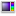](meta/ColorPicker.ColorCycle.md) | `ColorPicker.ColorCycle` |
|  | `ColorPicker.CycleColor` |
|  | `ColorPicker.CycleSlider` |
|  | `ColorPicker.SliderCycle` |
|  | `CompositeCollider2D Icon` |
|  | `ComputeShader Icon` |
|  | `ConfigurableJoint Icon` |
|   | `conflict-icon@2x` `conflict-icon` |
|   | `console.erroricon.inactive.sml@2x` `console.erroricon.inactive.sml` |
|   | `console.erroricon.sml@2x` `console.erroricon.sml` |
|   | `console.erroricon@2x` `console.erroricon` |
|   | `console.infoicon.inactive.sml@2x` `console.infoicon.inactive.sml` |
|   | `console.infoicon.sml@2x` `console.infoicon.sml` |
|   | `console.infoicon@2x` `console.infoicon` |
|   | `console.warnicon.inactive.sml@2x` `console.warnicon.inactive.sml` |
|   | `console.warnicon.sml@2x` `console.warnicon.sml` |
|   | `console.warnicon@2x` `console.warnicon` |
|  | `ConstantForce Icon` |
|  | `ConstantForce2D Icon` |
|  | `ContentSizeFitter Icon` |
|   | `CreateAddNew@2x` `CreateAddNew` |
|  | `CrossIcon` |
|  | `cs Script Icon` |
|  | `Cubemap Icon` |
|   | `curvekeyframe@2x` `curvekeyframe` |
|   | `curvekeyframeselected@2x` `curvekeyframeselected` |
|   | `curvekeyframeselectedoverlay@2x` `curvekeyframeselectedoverlay` |
|   | `curvekeyframesemiselectedoverlay@2x` `curvekeyframesemiselectedoverlay` |
|   | `curvekeyframeweighted@2x` `curvekeyframeweighted` |
|   | `Custom@2x` `Custom` |
|   | `Custom@2x` `Custom` |
|  | `CustomCollider2D Icon` |
|   | `Customized@2x` `Customized` |
|   | `Customized@2x` `Customized` |
|  | `CustomSorting` |
|   | `CustomTool@2x` `CustomTool` |
|   | `d__Help@2x` `d__Help` |
|   | `d__Menu@2x` `d__Menu` |
|   | `d__Popup@2x` `d__Popup` |
|   | `d_aboutwindow.mainheader@2x` `d_aboutwindow.mainheader` |
|  | `d_ageialogo` |
|  | `d_AimConstraint Icon` |
|  | `d_AISparkle Icon` |
|   | `d_AISparkle@2x` `d_AISparkle` |
|  | `d_align_horizontally` |
|  | `d_align_horizontally_center` |
|  | `d_align_horizontally_center_active` |
|  | `d_align_horizontally_left` |
|  | `d_align_horizontally_left_active` |
|  | `d_align_horizontally_right` |
|  | `d_align_horizontally_right_active` |
|  | `d_align_vertically` |
|  | `d_align_vertically_bottom` |
|  | `d_align_vertically_bottom_active` |
|  | `d_align_vertically_center` |
|  | `d_align_vertically_center_active` |
|  | `d_align_vertically_top` |
|  | `d_align_vertically_top_active` |
|   | `d_AlphabeticalSorting@2x` `d_AlphabeticalSorting` |
|  | `d_AnalyticsTracker Icon` |
|   | `d_AnchorTransformTool On@2x` `d_AnchorTransformTool On` |
|   | `d_AnchorTransformTool@2x` `d_AnchorTransformTool` |
|  | `d_Animation Icon` |
|   | `d_Animation.AddEvent@2x` `d_Animation.AddEvent` |
|   | `d_Animation.AddKeyframe@2x` `d_Animation.AddKeyframe` |
|   | `d_Animation.EventMarker@2x` `d_Animation.EventMarker` |
|   | `d_Animation.FilterBySelection@2x` `d_Animation.FilterBySelection` |
|   | `d_Animation.FirstKey@2x` `d_Animation.FirstKey` |
|   | `d_Animation.LastKey@2x` `d_Animation.LastKey` |
|   | `d_Animation.NextKey@2x` `d_Animation.NextKey` |
|   | `d_Animation.Play@2x` `d_Animation.Play` |
|   | `d_Animation.PrevKey@2x` `d_Animation.PrevKey` |
|   | `d_Animation.Record@2x` `d_Animation.Record` |
|  | `d_Animation.SequencerLink` |
|   | `d_animationanimated@2x` `d_animationanimated` |
|  | `d_AnimationClip Icon` |
|  | `d_AnimationClip On Icon` |
|   | `d_animationkeyframe@2x` `d_animationkeyframe` |
|  | `d_animationnocurve` |
|   | `d_animationvisibilitytoggleoff@2x` `d_animationvisibilitytoggleoff` |
|   | `d_animationvisibilitytoggleon@2x` `d_animationvisibilitytoggleon` |
|  | `d_AnimationWrapModeMenu` |
|  | `d_Animator Icon` |
|  | `d_AnimatorController Icon` |
|  | `d_AnimatorController On Icon` |
|  | `d_AnimatorOverrideController Icon` |
|  | `d_AnimatorOverrideController On Icon` |
|  | `d_AnimatorState Icon` |
|  | `d_AnimatorStateMachine Icon` |
|  | `d_AnimatorStateTransition Icon` |
|  | `d_AnyStateNode Icon` |
|  | `d_AreaEffector2D Icon` |
|  | `d_AreaLight Icon` |
|  | `d_ArticulationBody Icon` |
|  | `d_AS Badge Delete` |
|  | `d_AS Badge New` |
|  | `d_AspectRatioFitter Icon` |
|  | `d_Assembly Icon` |
|  | `d_AssemblyDefinitionAsset Icon` |
|  | `d_AssemblyDefinitionReferenceAsset Icon` |
|  | `d_AssemblyLock` |
|   | `d_Asset Store@2x` `d_Asset Store` |
|   | `d_AssetLabelIconSquare@2x` `d_AssetLabelIconSquare` |
|  | `d_AssetStore Icon` |
|   | `d_Audio Mixer@2x` `d_Audio Mixer` |
|  | `d_AudioChorusFilter Icon` |
|  | `d_AudioClip Icon` |
|  | `d_AudioClip On Icon` |
|  | `d_AudioDistortionFilter Icon` |
|  | `d_AudioEchoFilter Icon` |
|  | `d_AudioHighPassFilter Icon` |
|  | `d_AudioImporter Icon` |
|  | `d_AudioListener Icon` |
|  | `d_AudioLowPassFilter Icon` |
|  | `d_AudioMixerController Icon` |
|  | `d_AudioMixerController On Icon` |
|  | `d_AudioMixerGroup Icon` |
|  | `d_AudioMixerSnapshot Icon` |
|  | `d_AudioMixerView Icon` |
|  | `d_AudioRandomContainer Icon` |
|  | `d_AudioRandomContainer On Icon` |
|  | `d_AudioResource Icon` |
|  | `d_AudioResource On Icon` |
|  | `d_AudioReverbFilter Icon` |
|  | `d_AudioReverbZone Icon` |
|  | `d_AudioSource Icon` |
|  | `d_AudioSpatializerMicrosoft Icon` |
|   | `d_AutoLightbakingOff@2x` `d_AutoLightbakingOff` |
|   | `d_AutoLightbakingOn@2x` `d_AutoLightbakingOn` |
|  | `d_Avatar Icon` |
|  | `d_AvatarBlendBackground` |
|  | `d_AvatarBlendLeft` |
|  | `d_AvatarBlendLeftA` |
|  | `d_AvatarBlendRight` |
|  | `d_AvatarBlendRightA` |
|  | `d_AvatarCompass` |
|  | `d_AvatarMask Icon` |
|  | `d_AvatarMask On Icon` |
|   | `d_AvatarPivot@2x` `d_AvatarPivot` |
|  [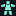](meta/d_AvatarSelector.md) | `d_AvatarSelector@2x` `d_AvatarSelector` |
|   | `d_back@2x` `d_back` |
|  | `d_beginButton` |
|  | `d_beginButton-On` |
| [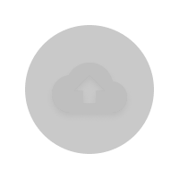](meta/d_BigIcons.CloudArrowUp@2x.md)  | `d_BigIcons.CloudArrowUp@2x` `d_BigIcons.CloudArrowUp` |
|   | `d_BigIcons.CloudCheckmark@2x` `d_BigIcons.CloudCheckmark` |
|   | `d_BigIcons.ExclamationMark@2x` `d_BigIcons.ExclamationMark` |
|   | `d_BigIcons.Gear@2x` `d_BigIcons.Gear` |
|  | `d_BillboardAsset Icon` |
|  | `d_BillboardRenderer Icon` |
|   | `d_BlendDistance On@2x` `d_BlendDistance On` |
|   | `d_BlendDistance@2x` `d_BlendDistance` |
|  | `d_BlendTree Icon` |
|  | `d_blueGroove` |
|  | `d_boo Script Icon` |
|  | `d_BoxCollider Icon` |
|  | `d_BoxCollider2D Icon` |
|  | `d_BuildProfile Icon` |
|   | `d_BuildSettings.Android.Small@2x` `d_BuildSettings.Android.Small` |
|   | `d_BuildSettings.Android@2x` `d_BuildSettings.Android` |
|  | `d_BuildSettings.Broadcom` |
|   | `d_BuildSettings.DedicatedServer.Small@2x` `d_BuildSettings.DedicatedServer.Small` |
|   | `d_BuildSettings.DedicatedServer@2x` `d_BuildSettings.DedicatedServer` |
|  | `d_BuildSettings.Editor` |
|   | `d_BuildSettings.Editor.Small@2x` `d_BuildSettings.Editor.Small` |
|  | `d_BuildSettings.EmbeddedLinux On` |
|   | `d_BuildSettings.EmbeddedLinux.Small@2x` `d_BuildSettings.EmbeddedLinux.Small` |
|   | `d_BuildSettings.EmbeddedLinux@2x` `d_BuildSettings.EmbeddedLinux` |
|   | `d_BuildSettings.Facebook.Small@2x` `d_BuildSettings.Facebook.Small` |
|   | `d_BuildSettings.Facebook@2x` `d_BuildSettings.Facebook` |
|  | `d_BuildSettings.FlashPlayer` |
|  | `d_BuildSettings.FlashPlayer.Small` |
|   | `d_BuildSettings.GameCoreScarlett.Small@2x` `d_BuildSettings.GameCoreScarlett.Small` |
|   | `d_BuildSettings.GameCoreScarlett@2x` `d_BuildSettings.GameCoreScarlett` |
|   | `d_BuildSettings.GameCoreXboxOne.Small@2x` `d_BuildSettings.GameCoreXboxOne.Small` |
|   | `d_BuildSettings.GameCoreXboxOne@2x` `d_BuildSettings.GameCoreXboxOne` |
|   | `d_BuildSettings.iPhone.Small@2x` `d_BuildSettings.iPhone.Small` |
|   | `d_BuildSettings.iPhone@2x` `d_BuildSettings.iPhone` |
|   | `d_BuildSettings.Linux.Small@2x` `d_BuildSettings.Linux.Small` |
|   | `d_BuildSettings.Linux@2x` `d_BuildSettings.Linux` |
|   | `d_BuildSettings.LinuxHeadlessSimulation.Small@2x` `d_BuildSettings.LinuxHeadlessSimulation.Small` |
|   | `d_BuildSettings.LinuxHeadlessSimulation@2x` `d_BuildSettings.LinuxHeadlessSimulation` |
|   | `d_BuildSettings.Lumin.small@2x` `d_BuildSettings.Lumin.small` |
|   | `d_BuildSettings.Lumin@2x` `d_BuildSettings.Lumin` |
|   | `d_BuildSettings.Meta.Small@2x` `d_BuildSettings.Meta.Small` |
|   | `d_BuildSettings.Meta@2x` `d_BuildSettings.Meta` |
|   | `d_BuildSettings.Metro.Small@2x` `d_BuildSettings.Metro.Small` |
|   | `d_BuildSettings.Metro@2x` `d_BuildSettings.Metro` |
|   | `d_BuildSettings.N3DS.Small@2x` `d_BuildSettings.N3DS.Small` |
|   | `d_BuildSettings.N3DS@2x` `d_BuildSettings.N3DS` |
|   | `d_BuildSettings.OSX.Small@2x` `d_BuildSettings.OSX.Small` |
|   | `d_BuildSettings.OSX@2x` `d_BuildSettings.OSX` |
|   | `d_BuildSettings.PS4.Small@2x` `d_BuildSettings.PS4.Small` |
|   | `d_BuildSettings.PS4@2x` `d_BuildSettings.PS4` |
|   | `d_BuildSettings.PS5.Small@2x` `d_BuildSettings.PS5.Small` |
|   | `d_BuildSettings.PS5@2x` `d_BuildSettings.PS5` |
|  | `d_BuildSettings.PSP2` |
|  | `d_BuildSettings.PSP2.Small` |
|   | `d_BuildSettings.QNX.Small@2x` `d_BuildSettings.QNX.Small` |
|   | `d_BuildSettings.QNX@2x` `d_BuildSettings.QNX` |
|  | `d_BuildSettings.SelectedIcon` |
|   | `d_BuildSettings.Stadia.Small@2x` `d_BuildSettings.Stadia.Small` |
|   | `d_BuildSettings.Stadia@2x` `d_BuildSettings.Stadia` |
|   | `d_BuildSettings.Standalone.Small@2x` `d_BuildSettings.Standalone.Small` |
|   | `d_BuildSettings.Standalone@2x` `d_BuildSettings.Standalone` |
|   | `d_BuildSettings.Switch.Small@2x` `d_BuildSettings.Switch.Small` |
|   | `d_BuildSettings.Switch@2x` `d_BuildSettings.Switch` |
|   | `d_BuildSettings.tvOS.Small@2x` `d_BuildSettings.tvOS.Small` |
|   | `d_BuildSettings.tvOS@2x` `d_BuildSettings.tvOS` |
|   | `d_BuildSettings.UnityPlay.Small@2x` `d_BuildSettings.UnityPlay.Small` |
|   | `d_BuildSettings.UnityPlay@2x` `d_BuildSettings.UnityPlay` |
|   | `d_BuildSettings.visionOS On.Small@2x` `d_BuildSettings.visionOS On.Small` |
|   | `d_BuildSettings.visionOS On@2x` `d_BuildSettings.visionOS On` |
|   | `d_BuildSettings.visionOS.Small@2x` `d_BuildSettings.visionOS.Small` |
|   | `d_BuildSettings.visionOS@2x` `d_BuildSettings.visionOS` |
|  | `d_BuildSettings.Web` |
|  | `d_BuildSettings.Web.Small` |
|   | `d_BuildSettings.WebGL.Small@2x` `d_BuildSettings.WebGL.Small` |
|   | `d_BuildSettings.WebGL@2x` `d_BuildSettings.WebGL` |
|   | `d_BuildSettings.Windows.Small@2x` `d_BuildSettings.Windows.Small` |
|   | `d_BuildSettings.Windows@2x` `d_BuildSettings.Windows` |
|  | `d_BuildSettings.Xbox360` |
|  | `d_BuildSettings.Xbox360.Small` |
|   | `d_BuildSettings.XboxOne.Small@2x` `d_BuildSettings.XboxOne.Small` |
|   | `d_BuildSettings.XboxOne@2x` `d_BuildSettings.XboxOne` |
|   | `d_BuildSettings.Xiaomi.Small@2x` `d_BuildSettings.Xiaomi.Small` |
|   | `d_BuildSettings.Xiaomi@2x` `d_BuildSettings.Xiaomi` |
|  | `d_BuoyancyEffector2D Icon` |
|  | `d_Button Icon` |
|   | `d_CacheServerConnected@2x` `d_CacheServerConnected` |
|   | `d_CacheServerDisabled@2x` `d_CacheServerDisabled` |
|   | `d_CacheServerDisconnected@2x` `d_CacheServerDisconnected` |
|  | `d_Camera Icon` |
|   | `d_CameraPreview@2x` `d_CameraPreview` |
|  | `d_Canvas Icon` |
|  | `d_CanvasGroup Icon` |
|  | `d_CanvasRenderer Icon` |
|  | `d_CanvasScaler Icon` |
|  | `d_CapsuleCollider Icon` |
|  | `d_CapsuleCollider2D Icon` |
|   | `d_CapturePosition On@2x` `d_CapturePosition On` |
|   | `d_CapturePosition@2x` `d_CapturePosition` |
|  | `d_CharacterController Icon` |
|  | `d_CharacterJoint Icon` |
|  | `d_CheckerFloor` |
|  | `d_CircleCollider2D Icon` |
|  | `d_Cloth Icon` |
|   | `d_CloudConnect@2x` `d_CloudConnect` |
|  | `d_Collab.FileAdded` |
|  | `d_Collab.FileConflict` |
|  | `d_Collab.FileDeleted` |
|  | `d_Collab.FileIgnored` |
|  | `d_Collab.FileMoved` |
|  | `d_Collab.FileUpdated` |
|  | `d_Collab.FolderAdded` |
|  | `d_Collab.FolderConflict` |
|  | `d_Collab.FolderDeleted` |
|  | `d_Collab.FolderIgnored` |
|  | `d_Collab.FolderMoved` |
|  | `d_Collab.FolderUpdated` |
|   | `d_Collab@2x` `d_Collab` |
|  | `d_CollabChanges Icon` |
|  | `d_CollabChangesConflict Icon` |
|  | `d_CollabChangesDeleted Icon` |
|  | `d_CollabConflict Icon` |
|  | `d_CollabCreate Icon` |
|  | `d_CollabDeleted Icon` |
|  | `d_CollabEdit Icon` |
|  | `d_CollabExclude Icon` |
|  | `d_CollabMoved Icon` |
|  | `d_ColorPicker.CycleColor` |
|  | `d_ColorPicker.CycleSlider` |
|  | `d_CompositeCollider2D Icon` |
|  | `d_ComputeShader Icon` |
|  | `d_ConfigurableJoint Icon` |
|   | `d_console.erroricon.inactive.sml@2x` `d_console.erroricon.inactive.sml` |
|   | `d_console.erroricon.sml@2x` `d_console.erroricon.sml` |
|   | `d_console.erroricon@2x` `d_console.erroricon` |
|   | `d_console.infoicon.inactive.sml@2x` `d_console.infoicon.inactive.sml` |
|   | `d_console.infoicon.sml@2x` `d_console.infoicon.sml` |
|   | `d_console.infoicon@2x` `d_console.infoicon` |
|   | `d_console.warnicon.inactive.sml@2x` `d_console.warnicon.inactive.sml` |
|   | `d_console.warnicon.sml@2x` `d_console.warnicon.sml` |
|   | `d_console.warnicon@2x` `d_console.warnicon` |
|  | `d_ConstantForce Icon` |
|  | `d_ConstantForce2D Icon` |
|  | `d_ContentSizeFitter Icon` |
|   | `d_CreateAddNew@2x` `d_CreateAddNew` |
|  | `d_cs Script Icon` |
|  | `d_Cubemap Icon` |
|   | `d_curvekeyframe@2x` `d_curvekeyframe` |
|   | `d_curvekeyframeselected@2x` `d_curvekeyframeselected` |
|   | `d_curvekeyframeselectedoverlay@2x` `d_curvekeyframeselectedoverlay` |
|   | `d_curvekeyframesemiselectedoverlay@2x` `d_curvekeyframesemiselectedoverlay` |
|   | `d_curvekeyframeweighted@2x` `d_curvekeyframeweighted` |
|  | `d_CustomSorting` |
|   | `d_CustomTool@2x` `d_CustomTool` |
|   | `d_DataMode.Authoring.Sticky@2x` `d_DataMode.Authoring.Sticky` |
|   | `d_DataMode.Authoring@2x` `d_DataMode.Authoring` |
|   | `d_DataMode.Mixed.Sticky@2x` `d_DataMode.Mixed.Sticky` |
|   | `d_DataMode.Mixed@2x` `d_DataMode.Mixed` |
|   | `d_DataMode.Runtime.Sticky@2x` `d_DataMode.Runtime.Sticky` |
|   | `d_DataMode.Runtime@2x` `d_DataMode.Runtime` |
|   | `d_debug@2x` `d_debug` |
|   | `d_DebuggerAttached@2x` `d_DebuggerAttached` |
|   | `d_DebuggerDisabled@2x` `d_DebuggerDisabled` |
|   | `d_DebuggerEnabled@2x` `d_DebuggerEnabled` |
|  | `d_DefaultAsset Icon` |
|   | `d_DefaultSorting@2x` `d_DefaultSorting` |
|  | `d_DirectionalLight Icon` |
|  | `d_DistanceJoint2D Icon` |
|  | `d_DragArrow` |
|  | `d_DragArrow@2x` |
|  | `d_Dropdown Icon` |
|  | `d_EdgeCollider2D Icon` |
|  | `d_EditCollider` |
|   | `d_editcollision_16@2x` `d_editcollision_16` |
|  | `d_editcollision_32` |
|   | `d_editconstraints_16@2x` `d_editconstraints_16` |
|  | `d_editconstraints_32` |
|  | `d_editicon.sml` |
|   | `d_EditShape On@2x` `d_EditShape On` |
|   | `d_EditShape@2x` `d_EditShape` |
|  | `d_endButton` |
|  | `d_endButton-On` |
|  | `d_EventSystem Icon` |
|  | `d_EventTrigger Icon` |
|   | `d_Exposure@2x` `d_Exposure` |
|   | `d_eyeDropper.Large@2x` `d_eyeDropper.Large` |
|  | `d_eyeDropper.sml` |
|   | `d_False@2x` `d_False` |
|  | `d_Favorite Icon` |
|  | `d_Favorite On Icon` |
|   | `d_Favorite@2x` `d_Favorite` |
|   | `d_Favorite_colored@2x` `d_Favorite_colored` |
|   | `d_Favorite_hover@2x` `d_Favorite_hover` |
|   | `d_File@2x` `d_File` |
|  | `d_Filter Icon` |
|   | `d_FilterByLabel@2x` `d_FilterByLabel` |
|   | `d_FilterByType@2x` `d_FilterByType` |
|   | `d_FilterSelectedOnly@2x` `d_FilterSelectedOnly` |
|  | `d_FixedJoint Icon` |
|  | `d_Flare Icon` |
|  | `d_Flare On Icon` |
|  | `d_FlareLayer Icon` |
|  | `d_Folder Icon` |
|  | `d_FolderEmpty Icon` |
|  | `d_FolderEmpty On Icon` |
|  | `d_FolderFavorite Icon` |
|  | `d_FolderFavorite On Icon` |
|  | `d_FolderOpened Icon` |
|  | `d_Font Icon` |
|   | `d_forward@2x` `d_forward` |
|   | `d_FrameCapture@2x` `d_FrameCapture` |
|  | `d_FreeformLayoutGroup Icon` |
|  | `d_FrictionJoint2D Icon` |
|   | `d_Fullscreen@2x` `d_Fullscreen` |
|   | `d_FullscreenOn@2x` `d_FullscreenOn` |
|  | `d_GameObject Icon` |
|   | `d_GameViewAudio On@2x` `d_GameViewAudio On` |
|   | `d_GameViewAudio@2x` `d_GameViewAudio` |
|  | `d_GEAR` |
|   | `d_GizmosToggle On@2x` `d_GizmosToggle On` |
|   | `d_GizmosToggle@2x` `d_GizmosToggle` |
|  | `d_GraphicRaycaster Icon` |
|   | `d_GreenCheckmark@2x` `d_GreenCheckmark` |
|  | `d_greenLight` |
|  | `d_Grid Icon` |
|   | `d_Grid.BoxTool@2x` `d_Grid.BoxTool` |
|   | `d_Grid.Default@2x` `d_Grid.Default` |
|   | `d_Grid.EraserTool@2x` `d_Grid.EraserTool` |
|   | `d_Grid.FillTool@2x` `d_Grid.FillTool` |
|   | `d_Grid.MoveTool@2x` `d_Grid.MoveTool` |
|   | `d_Grid.PaintTool@2x` `d_Grid.PaintTool` |
|   | `d_Grid.PickingTool@2x` `d_Grid.PickingTool` |
|   | `d_GridAndSnap@2x` `d_GridAndSnap` |
|   | `d_GridAxisX On@2x` `d_GridAxisX On` |
|   | `d_GridAxisX@2x` `d_GridAxisX` |
|   | `d_GridAxisY On@2x` `d_GridAxisY On` |
|   | `d_GridAxisY@2x` `d_GridAxisY` |
|   | `d_GridAxisZ On@2x` `d_GridAxisZ On` |
|   | `d_GridAxisZ@2x` `d_GridAxisZ` |
|  | `d_GridLayoutGroup Icon` |
|  | `d_GridLayoutGroup Icon` |
|   | `d_GridView On@2x` `d_GridView On` |
|  [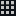](meta/d_GridView.md) | `d_GridView@2x` `d_GridView` |
|  | `d_Groove` |
|  | `d_GUISkin Icon` |
|  | `d_GUISkin On Icon` |
|  | `d_Halo Icon` |
|   | `d_Help@2x` `d_Help` |
|   | `d_HierarchyLock@2x` `d_HierarchyLock` |
|  | `d_HingeJoint Icon` |
|  | `d_HingeJoint2D Icon` |
|  | `d_HoloLensInputModule Icon` |
|  | `d_HorizontalLayoutGroup Icon` |
|  | `d_HorizontalLayoutGroup Icon` |
|  | `d_HorizontalSplit` |
|   | `d_icon dropdown open@2x` `d_icon dropdown open` |
|   | `d_icon dropdown@2x` `d_icon dropdown` |
|  | `d_IHVImageFormatImporter Icon` |
|  | `d_Image Icon` |
|   | `d_Import@2x` `d_Import` |
|   | `d_Incoming Icon@2x` `d_Incoming Icon` |
|  | `d_InputField Icon` |
|  | `d_InspectorLock` |
|   | `d_Invalid@2x` `d_Invalid` |
|  | `d_JointAngularLimits` |
|  | `d_Js Script Icon` |
|   | `d_Keyboard@2x` `d_Keyboard` |
|   | `d_KeyboardShortcutsDisabled@2x` `d_KeyboardShortcutsDisabled` |
|  | `d_LayoutElement Icon` |
|  | `d_leftBracket` |
|  | `d_Light Icon` |
|   | `d_Lighting@2x` `d_Lighting` |
|  | `d_LightingDataAsset Icon` |
|  | `d_LightingDataAssetParent Icon` |
|   | `d_LightingPreviewMode@2x` `d_LightingPreviewMode` |
|  | `d_LightingSettings Icon` |
|   | `d_LightingVisualization@2x` `d_LightingVisualization` |
| [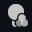](meta/d_LightingVisualizationColors@2x.md)  | `d_LightingVisualizationColors@2x` `d_LightingVisualizationColors` |
|   | `d_LightmapEditor.WindowTitle@2x` `d_LightmapEditor.WindowTitle` |
|  | `d_LightmapParameters Icon` |
|  | `d_LightmapParameters On Icon` |
|  | `d_lightOff` |
|  | `d_LightProbeGroup Icon` |
|  | `d_LightProbeProxyVolume Icon` |
|  | `d_LightProbes Icon` |
|  | `d_lightRim` |
|  | `d_LineRenderer Icon` |
|   | `d_Linked@2x` `d_Linked` |
|   | `d_ListView On@2x` `d_ListView On` |
|   | `d_ListView@2x` `d_ListView` |
|  | `d_LODGroup Icon` |
|  | `d_LookAtConstraint Icon` |
|   | `d_MainStageView@2x` `d_MainStageView` |
|  | `d_Mask Icon` |
|  | `d_Material Icon` |
|  | `d_Material On Icon` |
|  | `d_MaterialVariant Icon` |
|  | `d_Mesh Icon` |
|  | `d_MeshCollider Icon` |
|  | `d_MeshFilter Icon` |
|   | `d_MeshLOD On@2x` `d_MeshLOD On` |
|   | `d_MeshLOD@2x` `d_MeshLOD` |
|  | `d_MeshRenderer Icon` |
|  | `d_Microphone Icon` |
|  | `d_Mirror` |
|  | `d_model large` |
|  | `d_ModelImporter Icon` |
|  | `d_monologo` |
|   | `d_more@2x` `d_more` |
|   | `d_MoreOptions@2x` `d_MoreOptions` |
|  | `d_Motion Icon` |
| [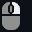](meta/d_MouseLeft@2x.md)  | `d_MouseLeft@2x` `d_MouseLeft` |
|   | `d_MouseLeft-Drag@2x` `d_MouseLeft-Drag` |
| [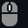](meta/d_MouseMiddle@2x.md) [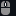](meta/d_MouseMiddle.md) | `d_MouseMiddle@2x` `d_MouseMiddle` |
| [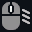](meta/d_MouseMiddle-Drag@2x.md)  | `d_MouseMiddle-Drag@2x` `d_MouseMiddle-Drag` |
|  [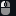](meta/d_MouseRight.md) | `d_MouseRight@2x` `d_MouseRight` |
|   | `d_MouseRight-Drag@2x` `d_MouseRight-Drag` |
|   | `d_MoveTool On@2x` `d_MoveTool on` |
|   | `d_MoveTool@2x` `d_MoveTool` |
|  | `d_Navigation` |
|  | `d_NavMeshAgent Icon` |
|  | `d_NavMeshData Icon` |
|  | `d_NavMeshObstacle Icon` |
|  | `d_NetworkAnimator Icon` |
|  | `d_NetworkDiscovery Icon` |
|  | `d_NetworkIdentity Icon` |
|  | `d_NetworkLobbyManager Icon` |
|  | `d_NetworkLobbyPlayer Icon` |
|  | `d_NetworkManager Icon` |
|  | `d_NetworkManagerHUD Icon` |
|  | `d_NetworkMigrationManager Icon` |
|  | `d_NetworkProximityChecker Icon` |
|  | `d_NetworkStartPosition Icon` |
|  | `d_NetworkTransform Icon` |
|  | `d_NetworkTransformChild Icon` |
|  | `d_NetworkTransformVisualizer Icon` |
|   | `d_NormalBlendDistance On@2x` `d_NormalBlendDistance On` |
|   | `d_NormalBlendDistance@2x` `d_NormalBlendDistance` |
|   | `d_Occlusion@2x` `d_Occlusion` |
|  | `d_OcclusionArea Icon` |
|  | `d_OcclusionPortal Icon` |
|  | `d_OffMeshLink Icon` |
|  | `d_orangeLight` |
|   | `d_OrientationGizmo@2x` `d_OrientationGizmo` |
|  | `d_Outgoing Icon@` |
|  | `d_Outgoing Icon@2x` |
|  | `d_Outline Icon` |
|   | `d_P4_AddedLocal@2x` `d_P4_AddedLocal` |
|   | `d_P4_AddedRemote@2x` `d_P4_AddedRemote` |
|   | `d_P4_BlueLeftParenthesis@2x` `d_P4_BlueLeftParenthesis` |
|  [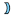](meta/d_P4_BlueRightParenthesis.md) | `d_P4_BlueRightParenthesis@2x` `d_P4_BlueRightParenthesis` |
|   | `d_P4_CheckOutLocal@2x` `d_P4_CheckOutLocal` |
|   | `d_P4_CheckOutRemote@2x` `d_P4_CheckOutRemote` |
|   | `d_P4_Conflicted@2x` `d_P4_Conflicted` |
|   | `d_P4_DeletedLocal@2x` `d_P4_DeletedLocal` |
|   | `d_P4_DeletedRemote@2x` `d_P4_DeletedRemote` |
|   | `d_P4_Local@2x` `d_P4_Local` |
|   | `d_P4_LockedLocal@2x` `d_P4_LockedLocal` |
|   | `d_P4_LockedRemote@2x` `d_P4_LockedRemote` |
|   | `d_P4_Offline@2x` `d_P4_Offline` |
|  [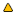](meta/d_P4_OutOfSync.md) | `d_P4_OutOfSync@2x` `d_P4_OutOfSync` |
|   | `d_P4_RedLeftParenthesis@2x` `d_P4_RedLeftParenthesis` |
|  [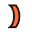](meta/d_P4_RedRightParenthesis.md) | `d_P4_RedRightParenthesis@2x` `d_P4_RedRightParenthesis` |
|   | `d_P4_Updating@2x` `d_P4_Updating` |
|   | `d_Package Manager@2x` `d_Package Manager` |
|   | `d_PackageManagerDefault@2x` `d_PackageManagerDefault` |
|   | `d_PackageManagerError@2x` `d_PackageManagerError` |
|   | `d_PackageManagerWarning@2x` `d_PackageManagerWarning` |
|  | `d_PanelSettings Icon` |
|  | `d_PanelSettings On Icon` |
|  | `d_ParentConstraint Icon` |
|  | `d_Particle Effect` |
|   | `d_ParticleShapeTool On@2x` `d_ParticleShapeTool On` |
|  | `d_ParticleShapeTool On@3x` |
|  | `d_ParticleShapeTool On@4x` |
|   | `d_ParticleShapeTool@2x` `d_ParticleShapeTool` |
|  | `d_ParticleShapeTool@3x` |
|  | `d_ParticleShapeTool@4x` |
|  | `d_ParticleSystem Icon` |
|  | `d_ParticleSystemForceField Icon` |
|   | `d_Pause@2x` `d_Pause` |
|   | `d_PauseButton On@2x` `d_PauseButton On` |
|   | `d_PauseButton@2x` `d_PauseButton` |
|   | `d_PBrowserPackagesNotVisible@2x` `d_PBrowserPackagesNotVisible` |
|   | `d_PBrowserPackagesVisible On@2x` `d_PBrowserPackagesVisible On` |
|   | `d_PBrowserPackagesVisible@2x` `d_PBrowserPackagesVisible` |
|   | `d_PBrowserPackagesVisible_hover@2x` `d_PBrowserPackagesVisible_hover` |
|  | `d_PhysicalResolution Icon` |
|  | `d_PhysicMaterial Icon` |
|  | `d_PhysicMaterial On Icon` |
|  | `d_Physics2DRaycaster Icon` |
|  | `d_PhysicsMaterial2D Icon` |
|  | `d_PhysicsMaterial2D On Icon` |
|  | `d_PhysicsRaycaster Icon` |
|  | `d_PlatformEffector2D Icon` |
|   | `d_Play@2x` `d_Play` |
|  | `d_PlayableDirector Icon` |
|   | `d_PlayButton On@2x` `d_PlayButton On` |
|   | `d_PlayButton@2x` `d_PlayButton` |
|  | `d_PlayButtonProfile` |
|  | `d_PlayButtonProfile On` |
|  | `d_playLoopOff` |
|  | `d_playLoopOn` |
|  | `d_PointEffector2D Icon` |
|  | `d_PolygonCollider2D Icon` |
|  | `d_PositionAsUV1 Icon` |
|  | `d_PositionConstraint Icon` |
|   | `d_preAudioAutoPlayOff@2x` `d_preAudioAutoPlayOff` |
|  | `d_preAudioAutoPlayOn` |
|   | `d_preAudioLoopOff@2x` `d_preAudioLoopOff` |
|  | `d_preAudioLoopOn` |
|  | `d_preAudioPlayOff` |
|  | `d_preAudioPlayOn` |
|  | `d_Prefab Icon` |
|  | `d_Prefab On Icon` |
|  | `d_PrefabModel Icon` |
|  | `d_PrefabModel On Icon` |
|  | `d_PrefabOverlayAdded Icon` |
|  | `d_PrefabOverlayAdded On Icon` |
|  | `d_PrefabOverlayRemoved Icon` |
|  | `d_PrefabOverlayRemoved On Icon` |
|  | `d_PrefabVariant Icon` |
|  | `d_PrefabVariant On Icon` |
|   | `d_PreMatCube@2x` `d_PreMatCube` |
|   | `d_PreMatCylinder@2x` `d_PreMatCylinder` |
|   | `d_PreMatLight0@2x` `d_PreMatLight0` |
|   | `d_PreMatLight1@2x` `d_PreMatLight1` |
|   | `d_PreMatQuad@2x` `d_PreMatQuad` |
|   | `d_PreMatSphere@2x` `d_PreMatSphere` |
|   | `d_PreMatTorus@2x` `d_PreMatTorus` |
|   | `d_Preset.Context@2x` `d_Preset.Context` |
|   | `d_Preset.Current@2x` `d_Preset.Current` |
|   | `d_PreTexA@2x` `d_PreTexA` |
|   | `d_PreTexB@2x` `d_PreTexB` |
|   | `d_PreTexG@2x` `d_PreTexG` |
|   | `d_PreTexR@2x` `d_PreTexR` |
|   | `d_PreTexRGB@2x` `d_PreTexRGB` |
|  | `d_PreTextureAlpha` |
|  | `d_PreTextureMipMapHigh` |
|  | `d_PreTextureMipMapLow` |
|  | `d_PreTextureRGB` |
|  | `d_ProbeAdjustmentVolume Icon` |
|  | `d_ProbeVolume Icon` |
|  | `d_ProbeVolumeBakingSet Icon` |
|  | `d_ProceduralMaterial Icon` |
|   | `d_Profiler.AssetLoading@2x` `d_Profiler.AssetLoading` |
|   | `d_Profiler.Audio@2x` `d_Profiler.Audio` |
|   | `d_Profiler.CPU@2x` `d_Profiler.CPU` |
|   | `d_Profiler.Custom@2x` `d_Profiler.Custom` |
|   | `d_Profiler.FileAccess@2x` `d_Profiler.FileAccess` |
|  | `d_Profiler.FirstFrame` |
|   | `d_Profiler.GlobalIllumination@2x` `d_Profiler.GlobalIllumination` |
|   | `d_Profiler.GPU@2x` `d_Profiler.GPU` |
|  | `d_Profiler.LastFrame` |
|   | `d_Profiler.Memory@2x` `d_Profiler.Memory` |
|  | `d_Profiler.Network` |
|   | `d_Profiler.NetworkMessages@2x` `d_Profiler.NetworkMessages` |
|   | `d_Profiler.NetworkOperations@2x` `d_Profiler.NetworkOperations` |
|  | `d_Profiler.NextFrame` |
|   | `d_Profiler.Open@2x` `d_Profiler.Open` |
|  | `d_Profiler.Open@4x` |
|   | `d_Profiler.Physics@2x` `d_Profiler.Physics` |
|   | `d_Profiler.Physics2D@2x` `d_Profiler.Physics2D` |
|  | `d_Profiler.PrevFrame` |
|  | `d_Profiler.Record` |
|   | `d_Profiler.Rendering@2x` `d_Profiler.Rendering` |
|   | `d_Profiler.UI@2x` `d_Profiler.UI` |
|   | `d_Profiler.UIDetails@2x` `d_Profiler.UIDetails` |
|   | `d_Profiler.Video@2x` `d_Profiler.Video` |
|   | `d_Profiler.VirtualTexturing@2x` `d_Profiler.VirtualTexturing` |
|  | `d_ProfilerColumn.WarningCount` |
|   | `d_Progress@2x` `d_Progress` |
|   | `d_Project@2x` `d_Project` |
|  | `d_Projector Icon` |
|  | `d_RawImage Icon` |
|  | `d_RaycastCollider Icon` |
|  | `d_RaytracingShader Icon` |
|  | `d_RayTracingShader Icon` |
|   | `d_Record Off@2x` `d_Record Off` |
|   | `d_Record On@2x` `d_Record On` |
|  | `d_RectMask2D Icon` |
|   | `d_RectTool On@2x` `d_RectTool On` |
|  [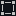](meta/d_RectTool.md) | `d_RectTool@2x` `d_RectTool` |
|  | `d_RectTransform Icon` |
|  | `d_RectTransformBlueprint` |
|  | `d_RectTransformRaw` |
|  | `d_redGroove` |
|  | `d_redLight` |
|  | `d_ReflectionProbe Icon` |
|   | `d_ReflectionProbeSelector@2x` `d_ReflectionProbeSelector` |
|   | `d_Refresh@2x` `d_Refresh` |
|  | `d_RelativeJoint2D Icon` |
|  | `d_RenderPipelineAsset Icon` |
|  | `d_RenderPipelineGlobalSettings Icon` |
|  | `d_RenderTexture Icon` |
|  | `d_RenderTexture On Icon` |
|  | `d_rightBracket` |
|  | `d_Rigidbody Icon` |
|  | `d_Rigidbody2D Icon` |
|   | `d_RotateTool On@2x` `d_RotateTool On` |
|   | `d_RotateTool@2x` `d_RotateTool` |
|  | `d_RotationConstraint Icon` |
|   | `d_SaveAs@2x` `d_SaveAs` |
|  | `d_ScaleConstraint Icon` |
|   | `d_ScaleTool On@2x` `d_ScaleTool On` |
|   | `d_ScaleTool@2x` `d_ScaleTool` |
|   | `d_Scene@2x` `d_Scene` |
|  | `d_SceneAsset Icon` |
|   | `d_SceneLayersToggle@2x` `d_SceneLayersToggle` |
|  | `d_SceneList Icon` |
|   | `d_scenepicking_notpickable@2x` `d_scenepicking_notpickable` |
|   | `d_scenepicking_notpickable_hover@2x` `d_scenepicking_notpickable_hover` |
|   | `d_scenepicking_notpickable-mixed@2x` `d_scenepicking_notpickable-mixed` |
|   | `d_scenepicking_notpickable-mixed_hover@2x` `d_scenepicking_notpickable-mixed_hover` |
|   | `d_scenepicking_pickable@2x` `d_scenepicking_pickable` |
|   | `d_scenepicking_pickable_hover@2x` `d_scenepicking_pickable_hover` |
|   | `d_scenepicking_pickable-mixed@2x` `d_scenepicking_pickable-mixed` |
|   | `d_scenepicking_pickable-mixed_hover@2x` `d_scenepicking_pickable-mixed_hover` |
|   | `d_SceneView2D On@2x` `d_SceneView2D On` |
|   | `d_SceneView2D@2x` `d_SceneView2D` |
| [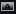](meta/d_SceneViewAlpha.md) | `d_SceneViewAlpha` |
|   | `d_SceneViewAudio On@2x` `d_SceneViewAudio On` |
|   | `d_SceneViewAudio@2x` `d_SceneViewAudio` |
|   | `d_SceneViewCamera@2x` `d_SceneViewCamera` |
|   | `d_SceneViewFX On@2x` `d_SceneViewFx On` |
|   | `d_SceneViewFX@2x` `d_SceneViewFx` |
|   | `d_SceneViewLighting On@2x` `d_SceneViewLighting On` |
|   | `d_SceneViewLighting@2x` `d_SceneViewLighting` |
|  | `d_SceneViewOrtho` |
|  | `d_SceneViewRGB` |
|   | `d_SceneViewSnap On@2x` `d_SceneViewSnap On` |
|   | `d_SceneViewSnap@2x` `d_SceneViewSnap` |
|   | `d_SceneViewTools On@2x` `d_SceneViewTools On` |
|   | `d_SceneViewTools@2x` `d_SceneViewTools` |
|   | `d_SceneViewVisibility On@2x` `d_SceneViewVisibility On` |
|   | `d_SceneViewVisibility@2x` `d_SceneViewVisibility` |
|   | `d_scenevis_hidden@2x` `d_scenevis_hidden` |
|   | `d_scenevis_hidden_hover@2x` `d_scenevis_hidden_hover` |
|   | `d_scenevis_hidden-mixed@2x` `d_scenevis_hidden-mixed` |
|   | `d_scenevis_hidden-mixed_hover@2x` `d_scenevis_hidden-mixed_hover` |
|   | `d_scenevis_scene_hover@2x` `d_scenevis_scene_hover` |
|   | `d_scenevis_visible@2x` `d_scenevis_visible` |
|   | `d_scenevis_visible_hover@2x` `d_scenevis_visible_hover` |
|   | `d_scenevis_visible-mixed@2x` `d_scenevis_visible-mixed` |
|   | `d_scenevis_visible-mixed_hover@2x` `d_scenevis_visible-mixed_hover` |
|  | `d_ScriptableObject Icon` |
|  | `d_ScriptableObject On Icon` |
|  | `d_Scrollbar Icon` |
|  | `d_ScrollRect Icon` |
|  | `d_ScrollShadow` |
|  | `d_ScrollViewArea Icon` |
|  | `d_Search Icon` |
|  | `d_SearchDatabase Icon` |
|  | `d_SearchJump Icon` |
|   | `d_SearchOverlay@2x` `d_SearchOverlay` |
|  | `d_SearchQuery Icon` |
|  | `d_SearchQueryAsset Icon` |
|  [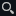](meta/d_SearchWindow.md) | `d_SearchWindow@2x` `d_SearchWindow` |
|  | `d_Selectable Icon` |
|  | `d_SelectionList Icon` |
|  | `d_SelectionListItem Icon` |
|  | `d_SelectionListTemplate Icon` |
|   | `d_SelectionWindow.Remove@2x` `d_SelectionWindow.Remove` |
|  | `d_ServerClient.Small` |
|   | `d_ServerClient@2x` `d_ServerClient` |
|  | `d_Settings Icon` |
|   | `d_Settings@2x` `d_Settings` |
|   | `d_SettingsIcon@2x` `d_SettingsIcon` |
|   | `d_Shaded@2x` `d_Shaded` |
|   | `d_ShadedWireframe@2x` `d_ShadedWireframe` |
|  | `d_Shader Icon` |
|  | `d_ShaderImporter Icon` |
|  | `d_ShaderInclude Icon` |
|  | `d_ShaderVariantCollection Icon` |
|  | `d_Shadow Icon` |
|  | `d_Shortcut Icon` |
|  | `d_ShowPanels` |
|  | `d_SignalAsset Icon` |
|  | `d_SignalEmitter Icon` |
|  | `d_SignalReceiver Icon` |
|  | `d_SkinnedMeshRenderer Icon` |
|   | `d_Skip@2x` `d_Skip` |
|  | `d_Skybox Icon` |
|  | `d_Slider Icon` |
|  | `d_SliderJoint2D Icon` |
| [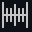](meta/d_SnapIncrement@2x.md)  | `d_SnapIncrement@2x` `d_SnapIncrement` |
|  | `d_SocialNetworks.FacebookShare` |
|  | `d_SocialNetworks.LinkedInShare` |
|  | `d_SocialNetworks.Tweet` |
|  | `d_SocialNetworks.UDNOpen` |
|  | `d_SortingGroup Icon` |
|  | `d_SpatialMappingCollider Icon` |
|  | `d_SpeedScale` |
|  | `d_SpeedTreeWindAsset Icon` |
|  | `d_SphereCollider Icon` |
|  | `d_Spotlight Icon` |
|  | `d_SpringJoint Icon` |
|  | `d_SpringJoint2D Icon` |
|  | `d_Sprite Icon` |
|  | `d_SpriteAtlas Icon` |
|  | `d_SpriteAtlas On Icon` |
|  | `d_SpriteAtlasAsset Icon` |
|  | `d_SpriteAtlasImporter Icon` |
|  | `d_SpriteMask Icon` |
|  | `d_SpriteRenderer Icon` |
|  | `d_SpriteShapeRenderer Icon` |
|  | `d_StandaloneInputModule Icon` |
|   | `d_StandardTools@2x` `d_StandardTools` |
|   | `d_StepButton On@2x` `d_StepButton On` |
|   | `d_StepButton@2x` `d_StepButton` |
|  | `d_StepLeftButton` |
|  | `d_StepLeftButton-On` |
|   | `d_Stop@2x` `d_Stop` |
|   | `d_StopButton@2x` `d_StopButton` |
|  | `d_StreamingController Icon` |
|  | `d_StyleSheet Icon` |
|  | `d_SurfaceEffector2D Icon` |
|   | `d_SyncSearch On@2x` `d_SyncSearch On` |
|   | `d_SyncSearch@2x` `d_SyncSearch` |
|   | `d_tab_next@2x` `d_tab_next` |
|   | `d_tab_prev@2x` `d_tab_prev` |
|   | `d_TableView On@2x` `d_TableView On` |
|  [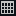](meta/d_TableView.md) | `d_TableView@2x` `d_TableView` |
|  | `d_TargetJoint2D Icon` |
|  | `d_Terrain Icon` |
|  | `d_TerrainCollider Icon` |
|  | `d_TerrainData Icon` |
|   | `d_TerrainInspector.TerrainToolAdd@2x` `d_TerrainInspector.TerrainToolAdd` |
|  | `d_TerrainInspector.TerrainToolLower On` |
|  | `d_TerrainInspector.TerrainToolLowerAlt` |
|  | `d_TerrainInspector.TerrainToolPlants On` |
|   | `d_TerrainInspector.TerrainToolPlants@2x` `d_TerrainInspector.TerrainToolPlants` |
|  | `d_TerrainInspector.TerrainToolPlantsAlt` |
|  | `d_TerrainInspector.TerrainToolPlantsAlt On` |
|  | `d_TerrainInspector.TerrainToolRaise` |
|  | `d_TerrainInspector.TerrainToolRaise On` |
|  | `d_TerrainInspector.TerrainToolSetheight` |
|  | `d_TerrainInspector.TerrainToolSetheight On` |
|  | `d_TerrainInspector.TerrainToolSetheightAlt` |
|  | `d_TerrainInspector.TerrainToolSetheightAlt On` |
|  | `d_TerrainInspector.TerrainToolSettings On` |
|   | `d_TerrainInspector.TerrainToolSettings@2x` `d_TerrainInspector.TerrainToolSettings` |
|  | `d_TerrainInspector.TerrainToolSmoothHeight` |
|  | `d_TerrainInspector.TerrainToolSmoothHeight On` |
|  | `d_TerrainInspector.TerrainToolSplat On` |
|   | `d_TerrainInspector.TerrainToolSplat@2x` `d_TerrainInspector.TerrainToolSplat` |
|  | `d_TerrainInspector.TerrainToolSplatAlt` |
|  | `d_TerrainInspector.TerrainToolSplatAlt On` |
|  | `d_TerrainInspector.TerrainToolTrees On` |
|   | `d_TerrainInspector.TerrainToolTrees@2x` `d_TerrainInspector.TerrainToolTrees` |
|  | `d_TerrainInspector.TerrainToolTreesAlt` |
|  | `d_TerrainInspector.TerrainToolTreesAlt On` |
|  | `d_Text Icon` |
|  | `d_TextAsset Icon` |
|  | `d_TextScriptImporter Icon` |
|  | `d_Texture Icon` |
|  | `d_Texture2D Icon` |
|   | `d_Texture2DArray On@2x` `d_Texture2DArray On` |
|   | `d_Texture2DArray@2x` `d_Texture2DArray` |
|  | `d_TextureImporter Icon` |
|  | `d_ThemeStyleSheet Icon` |
|  | `d_Tile Icon` |
|  | `d_Tilemap Icon` |
|  | `d_TilemapCollider2D Icon` |
|  | `d_TilemapRenderer Icon` |
|  | `d_TimelineAsset Icon` |
|  | `d_TimelineAsset On Icon` |
|  | `d_Toggle Icon` |
|   | `d_toggle_searcher_preview_off@2x` `d_toggle_searcher_preview_off` |
|   | `d_toggle_searcher_preview_off_hover@2x` `d_toggle_searcher_preview_off_hover` |
|   | `d_toggle_searcher_preview_on@2x` `d_toggle_searcher_preview_on` |
|   | `d_toggle_searcher_preview_on_hover@2x` `d_toggle_searcher_preview_on_hover` |
|  | `d_ToggleGroup Icon` |
|   | `d_ToggleUVOverlay@2x` `d_ToggleUVOverlay` |
|   | `d_Toolbar Minus@2x` `d_Toolbar Minus` |
|   | `d_Toolbar Plus More@2x` `d_Toolbar Plus More` |
|   | `d_Toolbar Plus@2x` `d_Toolbar Plus` |
|   | `d_ToolHandleCenter@2x` `d_ToolHandleCenter` |
|   | `d_ToolHandleGlobal@2x` `d_ToolHandleGlobal` |
|   | `d_ToolHandleLocal@2x` `d_ToolHandleLocal` |
|   | `d_ToolHandlePivot@2x` `d_ToolHandlePivot` |
|   | `d_ToolSettings@2x` `d_ToolSettings` |
|  | `d_ToolsIcon` |
|   | `d_ToolsToggle@2x` `d_ToolsToggle` |
|  | `d_TouchInputModule Icon` |
|  | `d_TrailRenderer Icon` |
|  | `d_tranp` |
|  | `d_Transform Icon` |
|   | `d_TransformTool On@2x` `d_TransformTool On` |
|   | `d_TransformTool@2x` `d_TransformTool` |
|  | `d_tree_icon` |
|  | `d_tree_icon_branch` |
|  | `d_tree_icon_branch_frond` |
|  | `d_tree_icon_frond` |
|  | `d_tree_icon_leaf` |
|  | `d_TreeEditor.AddBranches` |
|  | `d_TreeEditor.AddLeaves` |
|  | `d_TreeEditor.Branch` |
|  | `d_TreeEditor.Branch On` |
|  | `d_TreeEditor.BranchFreeHand` |
|  | `d_TreeEditor.BranchFreeHand On` |
|  | `d_TreeEditor.BranchRotate` |
|  | `d_TreeEditor.BranchRotate On` |
|  | `d_TreeEditor.BranchScale` |
|  | `d_TreeEditor.BranchScale On` |
|  | `d_TreeEditor.BranchTranslate` |
|  | `d_TreeEditor.BranchTranslate On` |
|  | `d_TreeEditor.Distribution` |
|  | `d_TreeEditor.Distribution On` |
|  | `d_TreeEditor.Duplicate` |
|  | `d_TreeEditor.Geometry` |
|  | `d_TreeEditor.Geometry On` |
|  | `d_TreeEditor.Leaf` |
|  | `d_TreeEditor.Leaf On` |
|  | `d_TreeEditor.LeafFreeHand` |
|  | `d_TreeEditor.LeafFreeHand On` |
|  | `d_TreeEditor.LeafRotate` |
|  | `d_TreeEditor.LeafRotate On` |
|  | `d_TreeEditor.LeafScale` |
|  | `d_TreeEditor.LeafScale On` |
|  | `d_TreeEditor.LeafTranslate` |
|  | `d_TreeEditor.LeafTranslate On` |
|  | `d_TreeEditor.Material` |
|  | `d_TreeEditor.Material On` |
|  | `d_TreeEditor.Refresh` |
|  | `d_TreeEditor.Trash` |
|  | `d_TreeEditor.Wind` |
|  | `d_TreeEditor.Wind On` |
|  | `d_TrueTypeFontImporter Icon` |
|  | `d_UIDocument Icon` |
|   | `d_UndoHistory@2x` `d_UndoHistory` |
|   | `d_UnityEditor.AnimationWindow@2x` `d_UnityEditor.AnimationWindow` |
|   | `d_UnityEditor.ConsoleWindow@2x` `d_UnityEditor.ConsoleWindow` |
|  | `d_UnityEditor.DebugInspectorWindow` |
|   | `d_UnityEditor.DeviceSimulation.SimulatorWindow@2x` `d_UnityEditor.DeviceSimulation.SimulatorWindow` |
|  | `d_UnityEditor.FindDependencies` |
|   | `d_UnityEditor.GameView@2x` `d_UnityEditor.GameView` |
|   | `d_UnityEditor.Graphs.AnimatorControllerTool@2x` `d_UnityEditor.Graphs.AnimatorControllerTool` |
|  | `d_UnityEditor.HierarchyWindow` |
|   | `d_UnityEditor.HistoryWindow@2x` `d_UnityEditor.HistoryWindow` |
|   | `d_UnityEditor.InspectorWindow@2x` `d_UnityEditor.InspectorWindow` |
|   | `d_UnityEditor.ProfilerWindow@2x` `d_UnityEditor.ProfilerWindow` |
|   | `d_UnityEditor.SceneHierarchyWindow@2x` `d_UnityEditor.SceneHierarchyWindow` |
|   | `d_UnityEditor.SceneView@2x` `d_UnityEditor.SceneView` |
|   | `d_UnityEditor.Timeline.TimelineWindow@2x` `d_UnityEditor.Timeline.TimelineWindow` |
|   | `d_UnityEditor.VersionControl@2x` `d_UnityEditor.VersionControl` |
|  | `d_UnityLogo` |
|  | `d_UnityPlayLogo` |
|   | `d_UnityPlayLogoSmall@2x` `d_UnityPlayLogoSmall` |
|   | `d_UnityProduct@2x` `d_UnityProduct` |
|   | `d_Unlinked@2x` `d_Unlinked` |
|   | `d_UnlitMode@2x` `d_UnlitMode` |
|   | `d_Valid@2x` `d_Valid` |
|   | `d_VariantArrow_Idle@2x` `d_VariantArrow_Idle` |
|  | `d_VerticalLayoutGroup Icon` |
|  | `d_VerticalLayoutGroup Icon` |
|  | `d_VerticalSplit` |
|  | `d_VideoPlayer Icon` |
|   | `d_ViewOptions@2x` `d_ViewOptions` |
|   | `d_ViewToolMove On@2x` `d_ViewToolMove On` |
|   | `d_ViewToolMove@2x` `d_ViewToolMove` |
|   | `d_ViewToolOrbit On@2x` `d_ViewToolOrbit On` |
|   | `d_ViewToolOrbit@2x` `d_ViewToolOrbit` |
|   | `d_ViewToolZoom On@2x` `d_ViewToolZoom On` |
|   | `d_ViewToolZoom@2x` `d_ViewToolZoom` |
|  | `d_VisibilityOff` |
|  | `d_VisibilityOn` |
|  | `d_VisualEffect Icon` |
|  | `d_VisualEffectAsset Icon` |
|  | `d_VisualEffectSubgraphBlock Icon` |
|  | `d_VisualEffectSubgraphOperator Icon` |
|   | `d_VisualQueryBuilder@2x` `d_VisualQueryBuilder` |
|  | `d_VisualTreeAsset Icon` |
|  | `d_VUMeterTextureHorizontal` |
|  | `d_VUMeterTextureVertical` |
|  | `d_WaitSpin00` |
|  | `d_WaitSpin01` |
|  | `d_WaitSpin02` |
|  | `d_WaitSpin03` |
|  | `d_WaitSpin04` |
|  | `d_WaitSpin05` |
|  | `d_WaitSpin06` |
|  | `d_WaitSpin07` |
|  | `d_WaitSpin08` |
|  | `d_WaitSpin09` |
|  | `d_WaitSpin10` |
|  | `d_WaitSpin11` |
|  | `d_WelcomeScreen.AssetStoreLogo` |
|  | `d_WheelCollider Icon` |
|  | `d_WheelJoint2D Icon` |
|  | `d_winbtn_graph` |
|  | `d_winbtn_graph_close_h` |
|  | `d_winbtn_graph_max_h` |
|  | `d_winbtn_graph_min_h` |
|   | `d_winbtn_mac_close_a@2x` `d_winbtn_mac_close_a` |
|  | `d_winbtn_mac_inact` |
|   | `d_winbtn_mac_min_a@2x` `d_winbtn_mac_min_a` |
|  | `d_winbtn_win_min` |
|  | `d_winbtn_win_min_a` |
|  | `d_winbtn_win_min_h` |
|  | `d_winbtn_win_rest` |
|  | `d_winbtn_win_rest_a` |
|  | `d_winbtn_win_rest_h` |
|  | `d_WindZone Icon` |
|   | `d_wireframe@2x` `d_wireframe` |
|   | `DataMode.Authoring.Sticky@2x` `DataMode.Authoring.Sticky` |
|   | `DataMode.Authoring@2x` `DataMode.Authoring` |
|   | `DataMode.Mixed.Sticky@2x` `DataMode.Mixed.Sticky` |
|   | `DataMode.Mixed@2x` `DataMode.Mixed` |
|   | `DataMode.Runtime.Sticky@2x` `DataMode.Runtime.Sticky` |
|   | `DataMode.Runtime@2x` `DataMode.Runtime` |
|   | `debug On@2x` `debug On` |
|   | `debug@2x` `debug` |
|   | `Debug_Frame_d@2x` `Debug_Frame_d` |
|   | `DebuggerAttached@2x` `DebuggerAttached` |
|   | `DebuggerDisabled@2x` `DebuggerDisabled` |
|   | `DebuggerEnabled@2x` `DebuggerEnabled` |
|  | `DefaultAsset Icon` |
|  | `DefaultSlate Icon` |
|   | `DefaultSorting@2x` `DefaultSorting` |
|   | `Dependency@2x` `Dependency` |
|   | `Dependency@2x` `Dependency` |
|   | `Dependency-Selected-Focused@2x` `Dependency-Selected-Focused` |
|  | `DirectionalLight Gizmo` |
|  | `DirectionalLight Icon` |
|  | `DiscLight Gizmo` |
|  | `DiscLight Icon` |
|  | `DistanceJoint2D Icon` |
|  | `dll Script Icon` |
|  | `DotFill` |
|  | `DotFrame` |
|  | `DotFrameDotted` |
|  | `DotSelection` |
|   | `Download-Available@2x` `Download-Available` |
|   | `Download-Available@2x` `Download-Available` |
|   | `Download-Available-Selected-Focused@2x` `Download-Available-Selected-Focused` |
|  | `DragArrow` |
|  | `DragArrow@2x` |
|  | `Dropdown Icon` |
|  | `EchoFilter Icon` |
|  | `EdgeCollider2D Icon` |
|  | `EditCollider` |
|   | `editcollision_16@2x` `editcollision_16` |
|  | `editcollision_32` |
|   | `editconstraints_16@2x` `editconstraints_16` |
|  | `editconstraints_32` |
|  | `editicon.sml` |
|  | `EditorSettings Icon` |
|   | `EditShape On@2x` `EditShape On` |
|   | `EditShape@2x` `EditShape` |
|  | `endButton` |
|  | `endButton-On` |
|   | `Error@2x` `Error` |
|   | `Error@2x` `Error` |
|  | `EventSystem Icon` |
|  | `EventTrigger Icon` |
|   | `Exposure@2x` `Exposure` |
|   | `eyeDropper.Large@2x` `eyeDropper.Large` |
|  | `eyeDropper.sml` |
|   | `False@2x` `False` |
|  | `Favorite Icon` |
|  | `Favorite On Icon` |
|   | `Favorite@2x` `Favorite` |
|   | `Favorite_colored@2x` `Favorite_colored` |
|   | `Feature@2x` `Feature` |
|   | `Feature-Selected@2x` `Feature-Selected` |
|   | `File@2x` `File` |
|  | `Filter Icon` |
|   | `FilterByLabel@2x` `FilterByLabel` |
|   | `FilterByType@2x` `FilterByType` |
|   | `FilterSelectedOnly@2x` `FilterSelectedOnly` |
|  | `FixedJoint Icon` |
|  | `FixedJoint2D Icon` |
|  | `Flare Icon` |
|  | `Flare On Icon` |
|  | `FlareLayer Icon` |
|  | `Folder Icon` |
|  | `Folder On Icon` |
|   | `Folder@2x` `Folder` |
|   | `Folder@2x` `Folder` |
|  | `FolderEmpty Icon` |
|  | `FolderEmpty On Icon` |
|  | `FolderFavorite Icon` |
|  | `FolderFavorite On Icon` |
|  | `FolderOpened Icon` |
|  | `FolderOpened On Icon` |
|  | `Font Icon` |
|  | `Font On Icon` |
|   | `forward@2x` `forward` |
|   | `FrameCapture On@2x` `FrameCapture On` |
|   | `FrameCapture@2x` `FrameCapture` |
|  | `FreeformLayoutGroup Icon` |
|  | `FrictionJoint2D Icon` |
|   | `Fullscreen@2x` `Fullscreen` |
|   | `FullscreenOn@2x` `FullscreenOn` |
|  | `GameManager Icon` |
|  | `GameObject Icon` |
|  | `GameObject On Icon` |
|   | `GameViewAudio On@2x` `GameViewAudio On` |
|   | `GameViewAudio@2x` `GameViewAudio` |
|  | `GEAR` |
|   | `Git@2x` `Git` |
|   | `Git@2x` `Git` |
|   | `GizmosToggle On@2x` `GizmosToggle On` |
|   | `GizmosToggle@2x` `GizmosToggle` |
|  | `GraphicRaycaster Icon` |
|   | `GreenCheckmark@2x` `GreenCheckmark` |
|  | `greenLight` |
|  | `Grid Icon` |
|   | `Grid.BoxTool@2x` `Grid.BoxTool` |
|   | `Grid.Default@2x` `Grid.Default` |
|   | `Grid.EraserTool@2x` `Grid.EraserTool` |
|   | `Grid.FillTool@2x` `Grid.FillTool` |
|   | `Grid.MoveTool@2x` `Grid.MoveTool` |
|   | `Grid.PaintTool@2x` `Grid.PaintTool` |
|   | `Grid.PickingTool@2x` `Grid.PickingTool` |
|   | `GridAndSnap@2x` `GridAndSnap` |
|   | `GridAxisX On@2x` `GridAxisX On` |
|   | `GridAxisX@2x` `GridAxisX` |
|   | `GridAxisY On@2x` `GridAxisY On` |
|   | `GridAxisY@2x` `GridAxisY` |
|   | `GridAxisZ On@2x` `GridAxisZ On` |
|   | `GridAxisZ@2x` `GridAxisZ` |
|  | `GridBrush Icon` |
|  | `GridLayoutGroup Icon` |
|   | `GridView On@2x` `GridView On` |
|   | `GridView@2x` `GridView` |
|  | `Grip_HorizontalContainer` |
|  | `Grip_VerticalContainer` |
|  | `Groove` |
|  | `GUILayer Icon` |
|  | `GUISkin Icon` |
|  | `GUISkin On Icon` |
|  | `GUIText Icon` |
|  | `GUITexture Icon` |
|  | `Halo Icon` |
|  | `Head` |
|  | `HeadIk` |
| [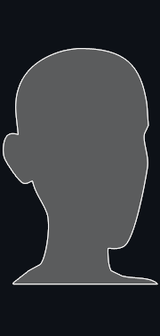](meta/HeadZoom.md) | `HeadZoom` |
|  | `HeadZoomSilhouette` |
|   | `Help@2x` `Help` |
|   | `HierarchyLock@2x` `HierarchyLock` |
|  | `HighPassFilter Icon` |
|  | `HingeJoint Icon` |
|  | `HingeJoint2D Icon` |
|  | `HoloLensInputModule Icon` |
|  | `HorizontalLayoutGroup Icon` |
|  | `HorizontalLayoutGroup Icon` |
|  | `HorizontalSplit` |
|  | `HoverBar_Down` |
|  | `HoverBar_LeftRight` |
|  | `HoverBar_Up` |
|  | `HumanTemplate Icon` |
|   | `icon dropdown open@2x` `icon dropdown open` |
|   | `icon dropdown@2x` `icon dropdown` |
|  | `IHVImageFormatImporter Icon` |
|  | `Image Icon` |
|   | `Import@2x` `Import` |
|   | `Import-Available@2x` `Import-Available` |
|   | `Import-Available@2x` `Import-Available` |
|   | `Import-Available-Selected-Focused@2x` `Import-Available-Selected-Focused` |
|   | `Import-Button@2x` `Import-Button` |
|   | `Import-Button@2x` `Import-Button` |
|   | `Incoming Icon@2x` `Incoming Icon` |
|   | `Incoming On Icon@2x` `Incoming On Icon` |
|   | `Info@2x` `Info` |
|   | `Info@2x` `Info` |
|   | `InProject@2x` `InProject` |
|   | `InProject@2x` `InProject` |
|   | `InProject-Selected-Focused@2x` `InProject-Selected-Focused` |
|  | `InputField Icon` |
|  | `InspectorLock` |
|   | `Installed@2x` `Installed` |
|   | `Installed@2x` `Installed` |
|   | `Installed-Selected-Focused@2x` `Installed-Selected-Focused` |
|   | `Invalid@2x` `Invalid` |
|  | `JointAngularLimits` |
|  | `Js Script Icon` |
|   | `Keyboard@2x` `Keyboard` |
|   | `KeyboardShortcutsDisabled@2x` `KeyboardShortcutsDisabled` |
|  | `KnobCShape` |
|  | `KnobCShapeMini` |
|  | `LayoutElement Icon` |
| [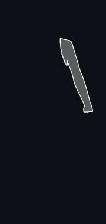](meta/LeftArm.md) | `LeftArm` |
|  | `leftBracket` |
|  | `LeftFeetIk` |
|  | `LeftFingers` |
|  | `LeftFingersIk` |
|  | `LeftHandZoom` |
|  | `LeftHandZoomSilhouette` |
|  | `LeftLeg` |
|  | `LensFlare Gizmo` |
|  | `LensFlare Icon` |
|  | `Light Icon` |
|   | `Lighting@2x` `Lighting` |
|  | `LightingDataAsset Icon` |
|  | `LightingDataAssetParent Icon` |
|   | `LightingPreviewMode On@2x` `LightingPreviewMode On` |
|   | `LightingPreviewMode@2x` `LightingPreviewMode` |
|  | `LightingSettings Icon` |
|   | `LightingVisualization@2x` `LightingVisualization` |
|   | `LightingVisualizationColors@2x` `LightingVisualizationColors` |
|   | `LightmapEditor.WindowTitle@2x` `LightmapEditor.WindowTitle` |
|  | `LightmapParameters Icon` |
|  | `LightmapParameters On Icon` |
|  | `Lightmapping` |
|  | `lightOff` |
|  | `LightProbeGroup Gizmo` |
|  | `LightProbeGroup Icon` |
|  | `LightProbeProxyVolume Gizmo` |
|  | `LightProbeProxyVolume Icon` |
|  | `LightProbes Icon` |
|  | `lightRim` |
|  | `LineRenderer Icon` |
|   | `Link@2x` `Link` |
|   | `Link@2x` `Link` |
|   | `Linked@2x` `Linked` |
|   | `ListView On@2x` `ListView On` |
|   | `ListView@2x` `ListView` |
|   | `Loading@2x` `Loading` |
|   | `Loading@2x` `Loading` |
|   | `Locked@2x` `Locked` |
|   | `Locked@2x` `Locked` |
|   | `Locked@2x` `Locked` |
|   | `Locked-Selected-Focused@2x` `Locked-Selected-Focused` |
|  | `LockIcon` |
|  | `LockIcon-On` |
|  | `LODGroup Icon` |
|  | `LookAtConstraint Icon` |
|  | `loop` |
|  | `LowPassFilter Icon` |
|  | `Main Light Gizmo` |
|   | `MainStageView@2x` `MainStageView` |
|  | `Mask Icon` |
|  | `MaskEditor_Root` |
|  | `Material Icon` |
|  | `Material On Icon` |
|  | `MaterialVariant Icon` |
|  | `Mesh Icon` |
|  | `MeshCollider Icon` |
|  | `MeshFilter Icon` |
|   | `MeshLOD On@2x` `MeshLOD On` |
|   | `MeshLOD@2x` `MeshLOD` |
|  | `MeshRenderer Icon` |
|  | `MetaFile Icon` |
|  | `Microphone Icon` |
|  | `Mirror` |
|  | `ModelImporter Icon` |
|   | `Mono-logo@2x` `Mono-logo` |
|   | `more@2x` `more` |
|   | `More@2x` `More` |
|   | `More@2x` `More` |
|   | `MoreOptions@2x` `MoreOptions` |
|  | `Motion Icon` |
|   | `MouseLeft@2x` `MouseLeft` |
|   | `MouseLeft-Drag@2x` `MouseLeft-Drag` |
|   | `MouseMiddle@2x` `MouseMiddle` |
|   | `MouseMiddle-Drag@2x` `MouseMiddle-Drag` |
|   | `MouseRight@2x` `MouseRight` |
|   | `MouseRight-Drag@2x` `MouseRight-Drag` |
|   | `MoveTool On@2x` `MoveTool on` |
|   | `MoveTool@2x` `MoveTool` |
|  | `MovieTexture Icon` |
|   | `MultiSelectFeature@2x` `MultiSelectFeature` |
|   | `MultiSelectFeature@2x` `MultiSelectFeature` |
|  | `MuscleClip Icon` |
|   | `MyAssets@2x` `MyAssets` |
|   | `MyAssets@2x` `MyAssets` |
|   | `MyAssets-Selected-Focused@2x` `MyAssets-Selected-Focused` |
|   | `MyRegistries@2x` `MyRegistries` |
|   | `MyRegistries@2x` `MyRegistries` |
|   | `MyRegistries-Selected-Focused@2x` `MyRegistries-Selected-Focused` |
|  | `Navigation` |
|  | `NavMeshAgent Icon` |
|  | `NavMeshData Icon` |
|  | `NavMeshObstacle Icon` |
|  | `NetworkAnimator Icon` |
|  | `NetworkDiscovery Icon` |
|  | `NetworkIdentity Icon` |
|  | `NetworkLobbyManager Icon` |
|  | `NetworkLobbyPlayer Icon` |
|  | `NetworkManager Icon` |
|  | `NetworkManagerHUD Icon` |
|  | `NetworkMigrationManager Icon` |
|  | `NetworkProximityChecker Icon` |
|  | `NetworkStartPosition Icon` |
|  | `NetworkTransform Icon` |
|  | `NetworkTransformChild Icon` |
|  | `NetworkTransformVisualizer Icon` |
|  | `NetworkView Icon` |
|   | `NormalBlendDistance On@2x` `NormalBlendDistance On` |
|   | `NormalBlendDistance@2x` `NormalBlendDistance` |
|   | `Occlusion@2x` `Occlusion` |
|  | `OcclusionArea Icon` |
|  | `OcclusionPortal Icon` |
|  | `OffMeshLink Icon` |
|  | `orangeLight` |
|   | `OrientationGizmo@2x` `OrientationGizmo` |
|   | `Outgoing Icon@2x` `Outgoing Icon` |
|  | `Outline Icon` |
|   | `P4_AddedLocal@2x` `P4_AddedLocal` |
|   | `P4_AddedRemote@2x` `P4_AddedRemote` |
|   | `P4_BlueLeftParenthesis@2x` `P4_BlueLeftParenthesis` |
|   | `P4_BlueRightParenthesis@2x` `P4_BlueRightParenthesis` |
|   | `P4_CheckOutLocal@2x` `P4_CheckOutLocal` |
|   | `P4_CheckOutRemote@2x` `P4_CheckOutRemote` |
|   | `P4_Conflicted@2x` `P4_Conflicted` |
|   | `P4_DeletedLocal@2x` `P4_DeletedLocal` |
|   | `P4_DeletedRemote@2x` `P4_DeletedRemote` |
|   | `P4_Local@2x` `P4_Local` |
|   | `P4_LockedLocal@2x` `P4_LockedLocal` |
|   | `P4_LockedRemote@2x` `P4_LockedRemote` |
|   | `P4_Offline@2x` `P4_Offline` |
|   | `P4_OutOfSync@2x` `P4_OutOfSync` |
|   | `P4_RedLeftParenthesis@2x` `P4_RedLeftParenthesis` |
|   | `P4_RedRightParenthesis@2x` `P4_RedRightParenthesis` |
|   | `P4_Updating@2x` `P4_Updating` |
|   | `Package Manager@2x` `Package Manager` |
|   | `Package@2x` `Package` |
|   | `Package@2x` `Package` |
|  | `package_installed` |
|  | `package_update` |
|  | `PackageBadgeNew` |
|  | `PackageBadgeOverride` |
|   | `PackageManagerDefault@2x` `PackageManagerDefault` |
|   | `PackageManagerError@2x` `PackageManagerError` |
|   | `PackageManagerWarning@2x` `PackageManagerWarning` |
|  | `PanelSettings Icon` |
|  | `PanelSettings On Icon` |
|  | `ParentConstraint Icon` |
|  | `Particle Effect` |
|   | `ParticleShapeTool On@2x` `ParticleShapeTool On` |
|  | `ParticleShapeTool On@3x` |
|  | `ParticleShapeTool On@4x` |
|   | `ParticleShapeTool@2x` `ParticleShapeTool` |
|  | `ParticleShapeTool@3x` |
|  | `ParticleShapeTool@4x` |
|  | `ParticleSystem Gizmo` |
|  | `ParticleSystem Icon` |
|  | `ParticleSystemForceField Gizmo` |
|  | `ParticleSystemForceField Icon` |
|   | `Pause@2x` `Pause` |
|   | `Pause@2x` `Pause` |
|   | `Pause@2x` `Pause` |
|   | `PauseButton On@2x` `PauseButton On` |
|   | `PauseButton@2x` `PauseButton` |
|   | `PBrowserPackagesNotVisible On@2x` `PBrowserPackagesNotVisible On` |
|   | `PBrowserPackagesNotVisible@2x` `PBrowserPackagesNotVisible` |
|   | `PBrowserPackagesVisible@2x` `PBrowserPackagesVisible` |
|   | `PBrowserPackagesVisible_hover@2x` `PBrowserPackagesVisible_hover` |
|  | `PhysicMaterial Icon` |
|  | `PhysicMaterial On Icon` |
|  | `Physics2DRaycaster Icon` |
|  | `PhysicsMaterial2D Icon` |
|  | `PhysicsMaterial2D On Icon` |
|  | `PhysicsRaycaster Icon` |
|   | `PhysX-logo@2x` `PhysX-logo` |
|   | `pin@2x` `pin` |
|   | `pinned@2x` `pinned` |
|  | `PlatformEffector2D Icon` |
|   | `Play@2x` `Play` |
|   | `Play@2x` `Play` |
|   | `Play@2x` `Play` |
|  | `PlayableDirector Icon` |
|   | `PlayButton On@2x` `PlayButton On` |
|   | `PlayButton@2x` `PlayButton` |
|  | `PlayButtonProfile` |
|  | `PlayButtonProfile On` |
|  | `playLoopOff` |
|  | `playLoopOn` |
|  | `playSpeed` |
|  | `PointEffector2D Icon` |
|  | `PointLight Gizmo` |
|  | `PolygonCollider2D Icon` |
|  | `PositionAsUV1 Icon` |
|  | `PositionConstraint Icon` |
|   | `preAudioAutoPlayOff@2x` `preAudioAutoPlayOff` |
|  | `preAudioAutoPlayOn` |
|   | `preAudioLoopOff@2x` `preAudioLoopOff` |
|  | `preAudioLoopOn` |
|  | `preAudioPlayOff` |
|  | `preAudioPlayOn` |
|  | `Prefab Icon` |
|  | `Prefab On Icon` |
|  | `PrefabModel Icon` |
|  | `PrefabModel On Icon` |
|  | `PrefabOverlayAdded Icon` |
|  | `PrefabOverlayAdded On Icon` |
|  | `PrefabOverlayModified Icon` |
|  | `PrefabOverlayRemoved Icon` |
|  | `PrefabOverlayRemoved On Icon` |
|  | `PrefabVariant Icon` |
|  | `PrefabVariant On Icon` |
|   | `PreMatCube@2x` `PreMatCube` |
|   | `PreMatCylinder@2x` `PreMatCylinder` |
|   | `PreMatLight0@2x` `PreMatLight0` |
|   | `PreMatLight1@2x` `PreMatLight1` |
|   | `PreMatQuad@2x` `PreMatQuad` |
|   | `PreMatSphere@2x` `PreMatSphere` |
|   | `PreMatTorus@2x` `PreMatTorus` |
|  | `Preset Icon` |
|   | `Preset.Context@2x` `Preset.Context` |
|   | `Preset.Current@2x` `Preset.Current` |
|   | `PreTexA@2x` `PreTexA` |
|   | `PreTexB@2x` `PreTexB` |
|   | `PreTexG@2x` `PreTexG` |
|   | `PreTexR@2x` `PreTexR` |
|   | `PreTexRGB@2x` `PreTexRGB` |
|  | `PreTextureAlpha` |
|  | `PreTextureArrayFirstSlice` |
|  | `PreTextureArrayLastSlice` |
|  | `PreTextureMipMapHigh` |
|  | `PreTextureMipMapLow` |
|  | `PreTextureRGB` |
|   | `PreviewPackageInUse@2x` `PreviewPackageInUse` |
|  | `ProbeAdjustmentVolume Icon` |
|  | `ProbeVolume Icon` |
|  | `ProbeVolumeBakingSet Icon` |
|  | `ProceduralMaterial Icon` |
|   | `Profiler.AssetLoading@2x` `Profiler.AssetLoading` |
|   | `Profiler.Audio@2x` `Profiler.Audio` |
|   | `Profiler.CPU@2x` `Profiler.CPU` |
|   | `Profiler.Custom@2x` `Profiler.Custom` |
|   | `Profiler.FileAccess@2x` `Profiler.FileAccess` |
|  | `Profiler.FirstFrame` |
|   | `Profiler.GlobalIllumination@2x` `Profiler.GlobalIllumination` |
|   | `Profiler.GPU@2x` `Profiler.GPU` |
|  | `Profiler.Instrumentation` |
|  | `Profiler.LastFrame` |
|   | `Profiler.Memory@2x` `Profiler.Memory` |
|   | `Profiler.NetworkMessages@2x` `Profiler.NetworkMessages` |
|   | `Profiler.NetworkOperations@2x` `Profiler.NetworkOperations` |
|  | `Profiler.NextFrame` |
|   | `Profiler.Physics@2x` `Profiler.Physics` |
|   | `Profiler.Physics2D@2x` `Profiler.Physics2D` |
|  | `Profiler.PrevFrame` |
|  | `Profiler.Record` |
|   | `Profiler.Rendering@2x` `Profiler.Rendering` |
|   | `Profiler.UI@2x` `Profiler.UI` |
|   | `Profiler.UIDetails@2x` `Profiler.UIDetails` |
|   | `Profiler.Video@2x` `Profiler.Video` |
|   | `Profiler.VirtualTexturing@2x` `Profiler.VirtualTexturing` |
|  | `ProfilerColumn.WarningCount` |
|   | `Progress@2x` `Progress` |
|   | `Project@2x` `Project` |
|  | `Projector Gizmo` |
|  | `Projector Icon` |
|   | `Quickstart@2x` `Quickstart` |
|  | `RawImage Icon` |
|  | `RaycastCollider Icon` |
|  | `RayTracingShader Icon` |
|  | `RayTracingShader Icon` |
|   | `Record Off@2x` `Record Off` |
|   | `Record On@2x` `Record On` |
|  | `RectMask2D Icon` |
|   | `RectTool On@2x` `RectTool On` |
|   | `RectTool@2x` `RectTool` |
|  | `RectTransform Icon` |
|  | `RectTransformBlueprint` |
|  | `RectTransformRaw` |
|  | `redGroove` |
|  | `redLight` |
|  | `ReflectionProbe Gizmo` |
|  | `ReflectionProbe Icon` |
|   | `ReflectionProbeSelector@2x` `ReflectionProbeSelector` |
|   | `Refresh@2x` `Refresh` |
|   | `Refresh@2x` `Refresh` |
|   | `Refresh@2x` `Refresh` |
|  | `RelativeJoint2D Icon` |
|  | `RenderPipelineAsset Icon` |
|  | `RenderPipelineGlobalSettings Icon` |
|  | `RenderTexture Icon` |
|  | `RenderTexture On Icon` |
|   | `RepaintDot@2x` `RepaintDot` |
|  | `ReverbFilter Icon` |
|  | `RightArm` |
|  | `rightBracket` |
|  | `RightFeetIk` |
|  | `RightFingers` |
|  | `RightFingersIk` |
|  | `RightHandZoom` |
|  | `RightHandZoomSilhouette` |
| [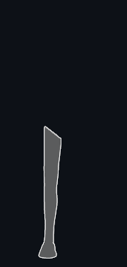](meta/RightLeg.md) | `RightLeg` |
|  | `Rigidbody Icon` |
|  | `Rigidbody2D Icon` |
|   | `RotateTool On@2x` `RotateTool On` |
|   | `RotateTool@2x` `RotateTool` |
|  | `RotateTool@4x` |
|  | `RotationConstraint Icon` |
|  | `SaveActive` |
|   | `SaveAs@2x` `SaveAs` |
|  | `SaveFromPlay` |
|  | `SavePassive` |
|  | `ScaleConstraint Icon` |
|   | `ScaleTool On@2x` `ScaleTool On` |
|   | `ScaleTool@2x` `ScaleTool` |
|   | `Scene@2x` `Scene` |
|  | `SceneAsset Icon` |
|  | `SceneAsset On Icon` |
|   | `SceneLayersToggle@2x` `SceneLayersToggle` |
|  | `SceneList Icon` |
|  | `SceneLoadIn` |
|  | `SceneLoadOut` |
|   | `scenepicking_notpickable@2x` `scenepicking_notpickable` |
|   | `scenepicking_notpickable_hover@2x` `scenepicking_notpickable_hover` |
|   | `scenepicking_notpickable-mixed@2x` `scenepicking_notpickable-mixed` |
|   | `scenepicking_notpickable-mixed_hover@2x` `scenepicking_notpickable-mixed_hover` |
|   | `scenepicking_pickable@2x` `scenepicking_pickable` |
|   | `scenepicking_pickable_hover@2x` `scenepicking_pickable_hover` |
|   | `scenepicking_pickable-mixed@2x` `scenepicking_pickable-mixed` |
|   | `scenepicking_pickable-mixed_hover@2x` `scenepicking_pickable-mixed_hover` |
|  | `SceneSave` |
|  | `SceneSaveGrey` |
|  | `SceneSet Icon` |
|  | `scene-template` |
|  | `scene-template-2d-scene` |
|  | `scene-template-3d-scene` |
|  | `SceneTemplateAsset Icon` |
|  | `scene-template-dark` |
|  | `scene-template-default-scene` |
|  | `scene-template-empty-scene` |
|  | `scene-template-light` |
|   | `SceneView2D On@2x` `SceneView2D On` |
| [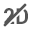](meta/SceneView2D@2x.md)  | `SceneView2D@2x` `SceneView2D` |
|  | `SceneViewAlpha` |
|   | `SceneViewAudio On@2x` `SceneViewAudio On` |
|   | `SceneViewAudio@2x` `SceneViewAudio` |
|   | `SceneViewCamera On@2x` `SceneViewCamera On` |
|   | `SceneViewCamera@2x` `SceneViewCamera` |
|   | `SceneViewFX On@2x` `SceneViewFx On` |
|   | `SceneViewFX@2x` `SceneViewFx` |
|   | `SceneViewLighting On@2x` `SceneViewLighting On` |
|   | `SceneViewLighting@2x` `SceneViewLighting` |
|  | `SceneViewOrtho` |
|  | `SceneViewRGB` |
|   | `SceneViewSnap On@2x` `SceneViewSnap On` |
|   | `SceneViewSnap@2x` `SceneViewSnap` |
|   | `SceneViewTools On@2x` `SceneViewTools On` |
|   | `SceneViewTools@2x` `SceneViewTools` |
|   | `SceneViewVisibility On@2x` `SceneViewVisibility On` |
|   | `SceneViewVisibility@2x` `SceneViewVisibility` |
|   | `scenevis_hidden@2x` `scenevis_hidden` |
|   | `scenevis_hidden_hover@2x` `scenevis_hidden_hover` |
|   | `scenevis_hidden-mixed@2x` `scenevis_hidden-mixed` |
|   | `scenevis_hidden-mixed_hover@2x` `scenevis_hidden-mixed_hover` |
|   | `scenevis_scene_hover@2x` `scenevis_scene_hover` |
|   | `scenevis_visible@2x` `scenevis_visible` |
|   | `scenevis_visible_hover@2x` `scenevis_visible_hover` |
|   | `scenevis_visible-mixed@2x` `scenevis_visible-mixed` |
|   | `scenevis_visible-mixed_hover@2x` `scenevis_visible-mixed_hover` |
|  | `ScriptableObject Icon` |
|  | `ScriptableObject On Icon` |
|  | `Scrollbar Icon` |
|  | `ScrollRect Icon` |
|  | `ScrollShadow` |
|  | `Search Icon` |
|  | `Search On Icon` |
|  | `SearchDatabase Icon` |
|  | `SearchJump Icon` |
|   | `SearchOverlay@2x` `SearchOverlay` |
|  | `SearchQuery Icon` |
|  | `SearchQueryAsset Icon` |
|   | `SearchWindow@2x` `SearchWindow` |
|  | `Selectable Icon` |
|   | `SelectionWindow.Remove@2x` `SelectionWindow.Remove` |
|  | `ServerClient.Small` |
|   | `ServerClient@2x` `ServerClient` |
|   | `Services@2x` `Services` |
|   | `Services@2x` `Services` |
|   | `Services-Selected-Focused@2x` `Services-Selected-Focused` |
|  | `Settings Icon` |
|   | `Settings@2x` `Settings` |
|   | `SettingsIcon@2x` `SettingsIcon` |
|   | `Shaded On@2x` `Shaded On` |
|   | `Shaded@2x` `Shaded` |
|   | `ShadedWireframe On@2x` `ShadedWireframe On` |
|   | `ShadedWireframe@2x` `ShadedWireframe` |
|  | `Shader Icon` |
|  | `ShaderImporter Icon` |
|  | `ShaderInclude Icon` |
|  | `ShaderVariantCollection Icon` |
|  | `Shadow Icon` |
|  | `Shortcut Icon` |
|  | `ShowPanels` |
|  | `SignalAsset Icon` |
|  | `SignalEmitter Icon` |
|  | `SignalReceiver Icon` |
|  | `SkinnedMeshRenderer Icon` |
|   | `Skip@2x` `Skip` |
|  | `Skybox Icon` |
|  | `Slider Icon` |
|  | `SliderJoint2D Icon` |
|   | `SnapIncrement@2x` `SnapIncrement` |
|  | `SocialNetworks.FacebookShare` |
|  | `SocialNetworks.LinkedInShare` |
|  | `SocialNetworks.Tweet` |
|  | `SocialNetworks.UDNLogo` |
|  | `SocialNetworks.UDNOpen` |
|  | `SoftlockInline` |
|  | `SoftlockProjectBrowser Icon` |
|  | `SortingGroup Icon` |
|  | `SpatialMappingCollider Icon` |
|  | `SpatialMappingRenderer Icon` |
|  | `SpeedScale` |
|  | `SpeedTree9Importer Icon` |
|  | `SpeedTreeImporter Icon` |
|  | `SpeedTreeModel Icon` |
|  | `SpeedTreeWindAsset Icon` |
|  | `SphereCollider Icon` |
|  | `SpotLight Gizmo` |
|  | `Spotlight Icon` |
|  | `SpringJoint Icon` |
|  | `SpringJoint2D Icon` |
|  | `Sprite Icon` |
|  | `SpriteAtlas Icon` |
|  | `SpriteAtlas On Icon` |
|  | `SpriteAtlasAsset Icon` |
|  | `SpriteAtlasImporter Icon` |
|  | `SpriteCollider Icon` |
|  | `SpriteMask Icon` |
|  | `SpriteRenderer Icon` |
|  | `SpriteShapeRenderer Icon` |
|  | `StandaloneInputModule Icon` |
|   | `StandardTools@2x` `StandardTools` |
|  | `StateMachineEditor.ArrowTip` |
|  | `StateMachineEditor.ArrowTipSelected` |
|  | `StateMachineEditor.Background` |
|  | `StateMachineEditor.State` |
| [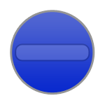](meta/StateMachineEditor.StateHover.md) | `StateMachineEditor.StateHover` |
|  | `StateMachineEditor.StateSelected` |
|  | `StateMachineEditor.StateSub` |
|  | `StateMachineEditor.StateSubHover` |
|  | `StateMachineEditor.StateSubSelected` |
|  | `StateMachineEditor.UpButton` |
|  | `StateMachineEditor.UpButtonHover` |
|   | `StepButton On@2x` `StepButton On` |
|   | `StepButton@2x` `StepButton` |
|  | `StepLeftButton` |
|  | `StepLeftButton-On` |
|   | `Stop@2x` `Stop` |
|   | `StopButton@2x` `StopButton` |
|  | `StreamingController Icon` |
|  | `StyleSheet Icon` |
|  | `SubstanceArchive Icon` |
|  | `SurfaceEffector2D Icon` |
|  | `sv_icon_dot0_pix16_gizmo` |
|  | `sv_icon_dot0_sml` |
| [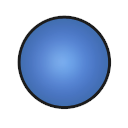](meta/sv_icon_dot1_pix16_gizmo.md) | `sv_icon_dot1_pix16_gizmo` |
|  | `sv_icon_dot1_sml` |
|  | `sv_icon_dot10_pix16_gizmo` |
|  | `sv_icon_dot10_sml` |
|  | `sv_icon_dot11_pix16_gizmo` |
|  | `sv_icon_dot11_sml` |
|  | `sv_icon_dot12_pix16_gizmo` |
|  | `sv_icon_dot12_sml` |
|  | `sv_icon_dot13_pix16_gizmo` |
|  | `sv_icon_dot13_sml` |
|  | `sv_icon_dot14_pix16_gizmo` |
|  | `sv_icon_dot14_sml` |
|  | `sv_icon_dot15_pix16_gizmo` |
|  | `sv_icon_dot15_sml` |
|  | `sv_icon_dot2_pix16_gizmo` |
|  | `sv_icon_dot2_sml` |
| [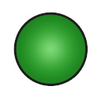](meta/sv_icon_dot3_pix16_gizmo.md) | `sv_icon_dot3_pix16_gizmo` |
|  | `sv_icon_dot3_sml` |
|  | `sv_icon_dot4_pix16_gizmo` |
|  | `sv_icon_dot4_sml` |
|  | `sv_icon_dot5_pix16_gizmo` |
|  | `sv_icon_dot5_sml` |
| [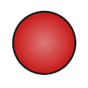](meta/sv_icon_dot6_pix16_gizmo.md) | `sv_icon_dot6_pix16_gizmo` |
|  | `sv_icon_dot6_sml` |
| [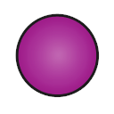](meta/sv_icon_dot7_pix16_gizmo.md) | `sv_icon_dot7_pix16_gizmo` |
|  | `sv_icon_dot7_sml` |
|  | `sv_icon_dot8_pix16_gizmo` |
|  | `sv_icon_dot8_sml` |
| [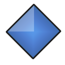](meta/sv_icon_dot9_pix16_gizmo.md) | `sv_icon_dot9_pix16_gizmo` |
| [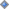](meta/sv_icon_dot9_sml.md) | `sv_icon_dot9_sml` |
|  | `sv_icon_name0` |
|  | `sv_icon_name1` |
|  | `sv_icon_name2` |
|  | `sv_icon_name3` |
|  | `sv_icon_name4` |
|  | `sv_icon_name5` |
|  | `sv_icon_name6` |
|  | `sv_icon_name7` |
|  | `sv_icon_none` |
|  | `sv_label_0` |
|  | `sv_label_1` |
|  | `sv_label_2` |
|  | `sv_label_3` |
|  | `sv_label_4` |
|  | `sv_label_5` |
|  | `sv_label_6` |
|  | `sv_label_7` |
|   | `SyncSearch On@2x` `SyncSearch On` |
|   | `SyncSearch@2x` `SyncSearch` |
|   | `tab_next@2x` `tab_next` |
|   | `tab_prev@2x` `tab_prev` |
|   | `TableView On@2x` `TableView On` |
|   | `TableView@2x` `TableView` |
|  | `TabToFilter` |
|  | `TargetJoint2D Icon` |
|  | `Terrain Icon` |
|  | `TerrainCollider Icon` |
|  | `TerrainData Icon` |
|   | `TerrainInspector.TerrainToolAdd@2x` `TerrainInspector.TerrainToolAdd` |
|  | `TerrainInspector.TerrainToolLower` |
|  | `TerrainInspector.TerrainToolLower On` |
|  | `TerrainInspector.TerrainToolLowerAlt` |
|  | `TerrainInspector.TerrainToolPlants On` |
|   | `TerrainInspector.TerrainToolPlants@2x` `TerrainInspector.TerrainToolPlants` |
|  | `TerrainInspector.TerrainToolPlantsAlt` |
|  | `TerrainInspector.TerrainToolPlantsAlt On` |
|  | `TerrainInspector.TerrainToolRaise` |
|  | `TerrainInspector.TerrainToolRaise On` |
|  | `TerrainInspector.TerrainToolSculpt` |
|  | `TerrainInspector.TerrainToolSculpt On` |
|  | `TerrainInspector.TerrainToolSetheight` |
|  | `TerrainInspector.TerrainToolSetheight On` |
|  | `TerrainInspector.TerrainToolSetheightAlt` |
|  | `TerrainInspector.TerrainToolSetheightAlt On` |
|  | `TerrainInspector.TerrainToolSettings On` |
|   | `TerrainInspector.TerrainToolSettings@2x` `TerrainInspector.TerrainToolSettings` |
|  | `TerrainInspector.TerrainToolSmoothHeight` |
|  | `TerrainInspector.TerrainToolSmoothHeight On` |
|  | `TerrainInspector.TerrainToolSplat On` |
|   | `TerrainInspector.TerrainToolSplat@2x` `TerrainInspector.TerrainToolSplat` |
|  | `TerrainInspector.TerrainToolSplatAlt` |
|  | `TerrainInspector.TerrainToolSplatAlt On` |
|  | `TerrainInspector.TerrainToolTrees On` |
|   | `TerrainInspector.TerrainToolTrees@2x` `TerrainInspector.TerrainToolTrees` |
|  | `TerrainInspector.TerrainToolTreesAlt` |
|  | `TerrainInspector.TerrainToolTreesAlt On` |
|  | `TestFailed` |
|  | `TestIgnored` |
|  | `TestInconclusive` |
|  | `TestNormal` |
|  | `TestPassed` |
|  | `TestStopwatch` |
|  | `Text Icon` |
|  | `TextAsset Icon` |
|  | `TextMesh Icon` |
|  | `TextScriptImporter Icon` |
|  | `Texture Icon` |
|  | `Texture2D Icon` |
|   | `Texture2DArray On@2x` `Texture2DArray On` |
|   | `Texture2DArray@2x` `Texture2DArray` |
|  | `TextureImporter Icon` |
|  | `ThemeStyleSheet Icon` |
|  | `Tile Icon` |
|  | `Tilemap Icon` |
|  | `TilemapCollider2D Icon` |
|  | `TilemapRenderer Icon` |
|  | `TimelineAsset Icon` |
|  | `TimelineAsset On Icon` |
|  | `Toggle Icon` |
|   | `toggle_searcher_preview_off@2x` `toggle_searcher_preview_off` |
|   | `toggle_searcher_preview_on@2x` `toggle_searcher_preview_on` |
|  | `ToggleGroup Icon` |
|   | `ToggleUVOverlay@2x` `ToggleUVOverlay` |
|   | `Toolbar Minus@2x` `Toolbar Minus` |
|   | `Toolbar Plus More@2x` `Toolbar Plus More` |
|   | `Toolbar Plus@2x` `Toolbar Plus` |
|   | `ToolHandleCenter@2x` `ToolHandleCenter` |
|   | `ToolHandleGlobal@2x` `ToolHandleGlobal` |
|   | `ToolHandleLocal@2x` `ToolHandleLocal` |
|   | `ToolHandlePivot@2x` `ToolHandlePivot` |
|   | `ToolSettings@2x` `ToolSettings` |
|  | `ToolsIcon` |
|   | `ToolsToggle@2x` `ToolsToggle` |
|  | `Torso` |
|  | `TouchInputModule Icon` |
|  | `TrackedPoseDriver Icon` |
|  | `TrailRenderer Icon` |
|  | `tranp` |
|  | `Transform Icon` |
|   | `TransformTool On@2x` `TransformTool On` |
|   | `TransformTool@2x` `TransformTool` |
|  | `Tree Icon` |
|  | `tree_icon` |
|  | `tree_icon_branch` |
|  | `tree_icon_branch_frond` |
|  | `tree_icon_frond` |
|  | `tree_icon_leaf` |
|  | `TreeEditor.AddBranches` |
|  | `TreeEditor.AddLeaves` |
|  | `TreeEditor.Branch` |
|  | `TreeEditor.Branch On` |
|  | `TreeEditor.BranchFreeHand` |
|  | `TreeEditor.BranchFreeHand On` |
|  | `TreeEditor.BranchRotate` |
|  | `TreeEditor.BranchRotate On` |
|  | `TreeEditor.BranchScale` |
|  | `TreeEditor.BranchScale On` |
|  | `TreeEditor.BranchTranslate` |
|  | `TreeEditor.BranchTranslate On` |
|  | `TreeEditor.Distribution` |
|  | `TreeEditor.Distribution On` |
|  | `TreeEditor.Duplicate` |
|  | `TreeEditor.Geometry` |
|  | `TreeEditor.Geometry On` |
|  | `TreeEditor.Leaf` |
|  | `TreeEditor.Leaf On` |
|  | `TreeEditor.LeafFreeHand` |
|  | `TreeEditor.LeafFreeHand On` |
|  | `TreeEditor.LeafRotate` |
|  | `TreeEditor.LeafRotate On` |
|  | `TreeEditor.LeafScale` |
|  | `TreeEditor.LeafScale On` |
|  | `TreeEditor.LeafTranslate` |
|  | `TreeEditor.LeafTranslate On` |
|  | `TreeEditor.Material` |
|  | `TreeEditor.Material On` |
|  | `TreeEditor.Refresh` |
|  | `TreeEditor.Trash` |
|  | `TreeEditor.Wind` |
|  | `TreeEditor.Wind On` |
|  | `TrueTypeFontImporter Icon` |
|  | `UIDocument Icon` |
|   | `UndoHistory@2x` `UndoHistory` |
|   | `UnityAboutLogo@2x` `UnityAboutLogo` |
|   | `Unity-AssetStore-Originals-Logo-White@2x` `Unity-AssetStore-Originals-Logo-White` |
|   | `UnityEditor.AnimationWindow@2x` `UnityEditor.AnimationWindow` |
|   | `UnityEditor.ConsoleWindow@2x` `UnityEditor.ConsoleWindow` |
|  | `UnityEditor.DebugInspectorWindow` |
|   | `UnityEditor.DeviceSimulation.SimulatorWindow@2x` `UnityEditor.DeviceSimulation.SimulatorWindow` |
|  | `UnityEditor.FindDependencies` |
|   | `UnityEditor.GameView@2x` `UnityEditor.GameView` |
|   | `UnityEditor.Graphs.AnimatorControllerTool@2x` `UnityEditor.Graphs.AnimatorControllerTool` |
|   | `UnityEditor.HierarchyWindow@2x` `UnityEditor.HierarchyWindow` |
|   | `UnityEditor.HistoryWindow@2x` `UnityEditor.HistoryWindow` |
|   | `UnityEditor.InspectorWindow@2x` `UnityEditor.InspectorWindow` |
|   | `UnityEditor.ProfilerWindow@2x` `UnityEditor.ProfilerWindow` |
|   | `UnityEditor.SceneHierarchyWindow@2x` `UnityEditor.SceneHierarchyWindow` |
|   | `UnityEditor.SceneView@2x` `UnityEditor.SceneView` |
|   | `UnityEditor.Timeline.TimelineWindow@2x` `UnityEditor.Timeline.TimelineWindow` |
|   | `UnityEditor.VersionControl@2x` `UnityEditor.VersionControl` |
|  | `UnityLogo` |
|  | `UnityLogoLarge` |
|  | `UnityPlayLogo` |
|   | `UnityPlayLogoSmall@2x` `UnityPlayLogoSmall` |
|   | `UnityProduct@2x` `UnityProduct` |
|   | `UnityRegistry@2x` `UnityRegistry` |
|   | `UnityRegistry@2x` `UnityRegistry` |
| [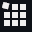](meta/UnityRegistry-Selected-Focused@2x.md)  | `UnityRegistry-Selected-Focused@2x` `UnityRegistry-Selected-Focused` |
|   | `UnityVersionLogo@2x` `UnityVersionLogo` |
|   | `UnLinked@2x` `UnLinked` |
|   | `UnlitMode On@2x` `UnlitMode On` |
|   | `UnlitMode@2x` `UnlitMode` |
|   | `Unlocked@2x` `Unlocked` |
|   | `Unlocked@2x` `Unlocked` |
|   | `Unlocked@2x` `Unlocked` |
|   | `Unlocked-Selected-Focused@2x` `Unlocked-Selected-Focused` |
|  | `UpArrow` |
|   | `Update-Available@2x` `Update-Available` |
|   | `Update-Available@2x` `Update-Available` |
|   | `Update-Available-Selected-Focused@2x` `Update-Available-Selected-Focused` |
|  | `UssScript Icon` |
|  | `UxmlScript Icon` |
|   | `Valid@2x` `Valid` |
|   | `VariantArrow_Active@2x` `VariantArrow_Active` |
|   | `VariantArrow_Idle@2x` `VariantArrow_Idle` |
|  | `VerticalLayoutGroup Icon` |
|  | `VerticalLayoutGroup Icon` |
|  | `VerticalSplit` |
|  | `VideoClip Icon` |
|  | `VideoClipImporter Icon` |
|  | `VideoEffect Icon` |
|  | `VideoPlayer Icon` |
|   | `ViewOptions@2x` `ViewOptions` |
|   | `ViewToolMove On@2x` `ViewToolMove On` |
|   | `ViewToolMove@2x` `ViewToolMove` |
|   | `ViewToolOrbit On@2x` `ViewToolOrbit On` |
|   | `ViewToolOrbit@2x` `ViewToolOrbit` |
|   | `ViewToolZoom On@2x` `ViewToolZoom On` |
|   | `ViewToolZoom@2x` `ViewToolZoom` |
|  | `VisibilityOff` |
|  | `VisibilityOn` |
|  | `VisualEffect Gizmo` |
|  | `VisualEffect Icon` |
|  | `VisualEffect Icon` |
|  | `VisualEffectAsset Icon` |
|  | `VisualEffectAsset Icon` |
|  | `VisualEffectAsset Icon` |
|  | `VisualEffectSubgraphBlock Icon` |
|  | `VisualEffectSubgraphOperator Icon` |
|   | `VisualQueryBuilder@2x` `VisualQueryBuilder` |
|  | `VisualTreeAsset Icon` |
|  | `VUMeterTextureHorizontal` |
|  | `VUMeterTextureVertical` |
|  | `WaitSpin00` |
|  | `WaitSpin01` |
|  | `WaitSpin02` |
|  | `WaitSpin03` |
|  | `WaitSpin04` |
|  | `WaitSpin05` |
|  | `WaitSpin06` |
|  | `WaitSpin07` |
|  | `WaitSpin08` |
|  | `WaitSpin09` |
|  | `WaitSpin10` |
|  | `WaitSpin11` |
|   | `Warning@2x` `Warning` |
|   | `Warning@2x` `Warning` |
|  | `WelcomeScreen.AssetStoreLogo` |
|  | `WheelCollider Icon` |
|  | `WheelJoint2D Icon` |
|  | `winbtn_graph` |
|  | `winbtn_graph_close_h` |
|  | `winbtn_graph_max_h` |
|  | `winbtn_graph_min_h` |
|   | `winbtn_mac_close_a@2x` `winbtn_mac_close_a` |
|   | `winbtn_mac_inact@2x` `winbtn_mac_inact` |
|   | `winbtn_mac_min_a@2x` `winbtn_mac_min_a` |
|  | `winbtn_win_min` |
|  | `winbtn_win_min_a` |
|  | `winbtn_win_min_h` |
|  | `winbtn_win_rest` |
|  | `winbtn_win_rest_a` |
|  | `winbtn_win_rest_h` |
|  | `WindZone Gizmo` |
|  | `WindZone Icon` |
|   | `Wireframe On@2x` `Wireframe On` |
|   | `wireframe@2x` `wireframe` |

*Original script author [@halak](https://github.com/halak)*
